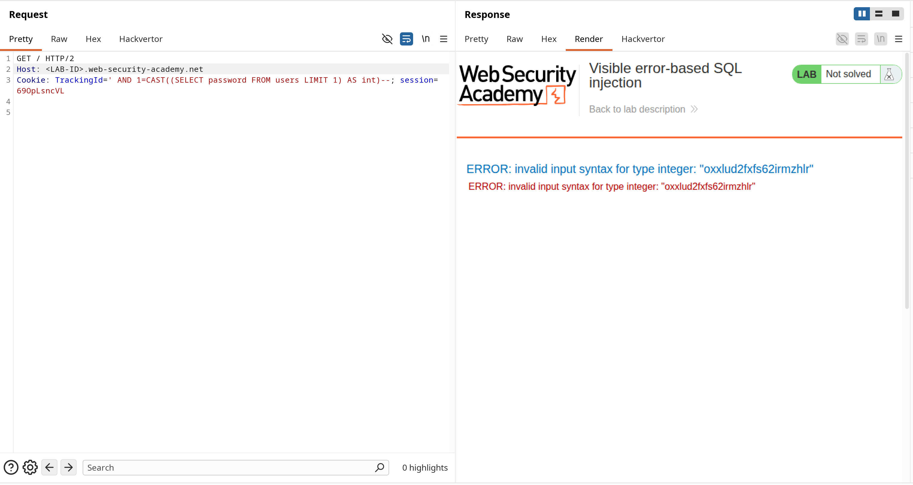
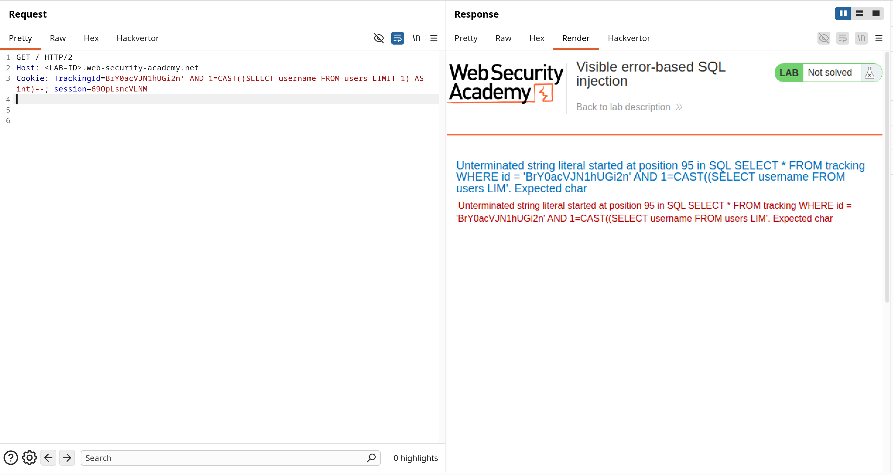
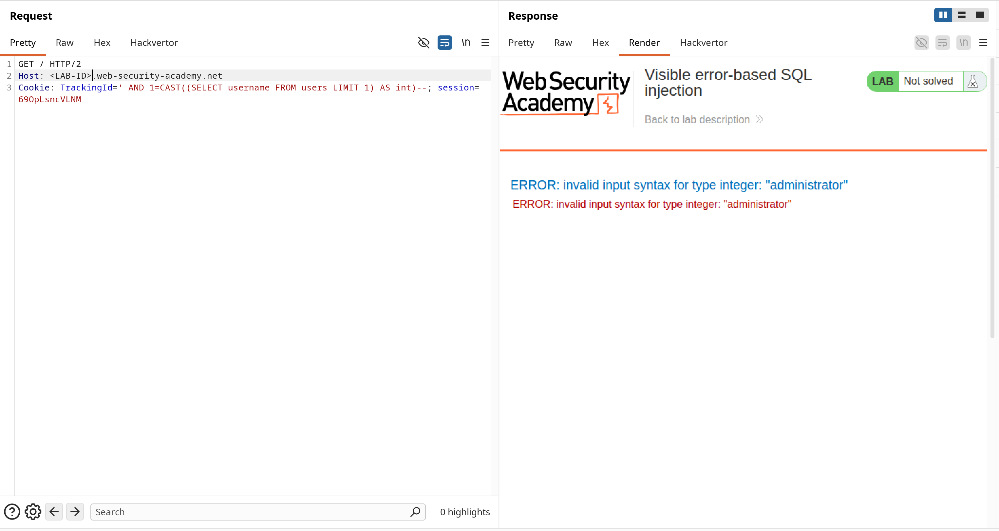

**Category:** SQL Injection  
**Difficulty:** Practitioner  
**Status:** ✅ Solved  
**Lab Link:** [PortSwigger Lab](https://portswigger.net/web-security/sql-injection/blind/lab-sql-injection-visible-error-based)

---

## Objective

This lab contains a SQL injection vulnerability. The application uses a tracking cookie for analytics, and performs a SQL query containing the value of the submitted cookie. The results of the SQL query are not returned.

The database contains a different table called `users`, with columns called `username` and `password`. To solve the lab, find a way to leak the password for the `administrator` user, then log in to their account.

---

## Background

Error-based SQL injection is a technique that exploits improper error handling in database queries to extract sensitive information. This vulnerability occurs when an application displays detailed database error messages to the user, which can inadvertently reveal data from the database. By intentionally causing type conversion errors, attackers can force the database to include query results in error messages.

---

## My Approach

### Step 1: Identify the Injection Point

Using Burp Suite Repeater, I identified that the `TrackingId` cookie is vulnerable to SQL injection. The application executes a SQL query using the cookie value without proper sanitization.

### Step 2: Understand the Error-Based Technique

This lab uses PostgreSQL, which reveals data through type conversion errors. The technique involves:

1. Using `CAST()` or `::int` to convert string data to an integer
2. This conversion fails for non-numeric strings
3. PostgreSQL's error message includes the actual string value that failed conversion
4. This leaks the data directly in the error message

### Step 3: Extract the Username

I injected the following payload to extract the username:

```
Cookie: TrackingId=' AND 1=CAST((SELECT username FROM users LIMIT 1) AS int)--
```

The response revealed:
```
ERROR: invalid input syntax for type integer: "administrator"
```

This confirmed:
- The database is PostgreSQL
- There is a `users` table
- The first username is `administrator`



### Step 4: Extract the Password

Using the same technique, I extracted the administrator's password:

```
Cookie: TrackingId=' AND 1=CAST((SELECT password FROM users LIMIT 1) AS int)--
```

The response revealed:
```
ERROR: invalid input syntax for type integer: "oxxlud2fxfs62irmzhir"
```

This leaked the password: `oxxlud2fxfs62irmzhir`



### Step 5: Log In as Administrator

I navigated to **My Account** and logged in with:
- **Username:** `administrator`
- **Password:** `oxxlud2fxfs62irmzhir`



---

## Payload Used

### Username Extraction
```URL
Cookie: TrackingId=' AND 1=CAST((SELECT username FROM users LIMIT 1) AS int)--
```

### Password Extraction
```URL
Cookie: TrackingId=' AND 1=CAST((SELECT password FROM users LIMIT 1) AS int)--
```

**How it works:**
- `'` — Closes the original string parameter
- `AND 1=CAST(...)` — Forces a type conversion that will fail
- `(SELECT username/password FROM users LIMIT 1)` — Subquery that retrieves the data
- `AS int` — Attempts to convert the string to an integer (will fail)
- `--` — Comments out the rest of the query

---

## Why It Worked

The application executes a SQL query using the tracking cookie value and displays detailed PostgreSQL error messages to the user. When the `CAST()` function attempts to convert a non-numeric string (like a password) to an integer, PostgreSQL throws an error that includes the actual string value.

### Attack Breakdown

| Component | Purpose |
|-----------|---------|
| `'` | Closes the original string parameter in the cookie value |
| `AND 1=...` | Adds a condition that will always fail type conversion |
| `CAST((SELECT password FROM users LIMIT 1) AS int)` | Attempts to convert the password string to an integer, causing an error |
| `LIMIT 1` | Ensures only one row is returned (required for subquery) |
| `--` | SQL comment sequence that neutralizes the rest of the original query |

The attack succeeded because:

1. **Injection point identified** (tracking cookie is concatenated into SQL query)
2. **Verbose error messages** (PostgreSQL reveals the actual data in error messages)
3. **Type conversion failure** (CAST to int fails for string data, triggering the error)
4. **No error handling** (application displays raw database errors to the user)
5. **Direct data exfiltration** (no need for boolean-based or time-based techniques—data leaks directly)

---

## How to Fix It

The only reliable defense is to **use parameterized queries (prepared statements)**. This ensures user input is treated as data, not executable code.

See [Lab 1: SQL Injection Fundamentals](1.%20SQL%20injection%20vulnerability%20in%20WHERE%20clause%20allowing%20retrieval%20of%20hidden%20data.md) for language-specific examples.

### Additional Recommendations

| Defense | Description |
|---------|-------------|
| **Parameterized Queries** | Always use placeholders instead of concatenating user input (including cookies!) |
| **Generic Error Messages** | Never display detailed database errors to users—use generic messages like "An error occurred" |
| **Error Logging** | Log detailed errors server-side for debugging, but show users only generic messages |
| **Input Validation** | Validate cookie format and reject unexpected values |
| **Web Application Firewall (WAF)** | Deploy a WAF to detect and block SQL injection patterns |

---

## Key Takeaway

> Error-based SQL injection can be more efficient than boolean-based or time-based blind injection because data leaks directly in error messages. PostgreSQL's verbose error reporting makes it particularly vulnerable to this technique. Always use **parameterized queries** and implement proper error handling that displays generic messages to users. Never expose database errors in production environments—detailed errors should be logged server-side only. This lab demonstrates why "security through obscurity" (hiding errors) is not enough; you need both parameterized queries AND proper error handling.
