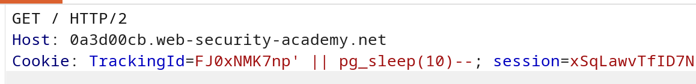

**Category:** SQL Injection  
**Difficulty:** Practitioner  
**Status:** ✅ Solved  
**Lab Link:** [PortSwigger Lab](https://portswigger.net/web-security/sql-injection/blind/lab-time-delays)

---

## Objective

This lab contains a blind SQL injection vulnerability. The application uses a tracking cookie for analytics, and performs a SQL query containing the value of the submitted cookie.

The results of the SQL query are not returned, and the application does not respond any differently based on whether the query returns any rows or causes an error. However, since the query is executed synchronously, it is possible to trigger conditional time delays to infer information.

To solve the lab, exploit the SQL injection vulnerability to cause a 10 second delay.

---

## Background

Time-based blind SQL injection is a technique that exploits vulnerabilities by triggering deliberate delays in database query execution. This occurs when user input is concatenated into SQL queries without proper sanitization, and the application doesn't display query results or errors. By injecting time-delay functions, attackers can infer the success of their injection based on response time, making it possible to extract data character-by-character even when no other feedback is available.

---

## My Approach

### Step 1: Identify the Injection Point

Using Burp Suite Repeater, I identified that the `TrackingId` cookie is vulnerable to SQL injection. The application executes a SQL query using the cookie value without proper sanitization.

### Step 2: Confirm SQL Injection with Time Delay

Since the application doesn't show results or errors, I needed to confirm the injection using a time-based technique. I injected a payload that triggers a 10-second delay:

```
TrackingId=Fj0xndf2g5'; SELECT pg_sleep(10)--
```

If the application responds after approximately 10 seconds, it confirms:
- The injection point is valid
- The database is PostgreSQL (based on `pg_sleep` function)
- The query is executed synchronously

### Step 3: Understanding Database-Specific Time Delay Functions

Different databases use different functions for time delays:

| Database | Time Delay Function | Example |
|----------|-------------------|---------|
| **PostgreSQL** | `pg_sleep(seconds)` | `SELECT pg_sleep(10)` |
| **MySQL** | `SLEEP(seconds)` | `SELECT SLEEP(10)` |
| **Oracle** | `dbms_pipe.receive_message(('a'),seconds)` | `SELECT dbms_pipe.receive_message(('a'),10) FROM dual` |
| **SQL Server** | `WAITFOR DELAY '0:0:seconds'` | `WAITFOR DELAY '0:0:10'` |

Since `pg_sleep(10)` worked, this confirms the database is **PostgreSQL**.

### Step 4: Alternative Payload Syntax

I also tested an expression-based payload:

```
TrackingId=Fj0xndf2g5' || pg_sleep(10)--
```

> ⚠️ **Note:** `pg_sleep()` returns `void`, not a string — so `||` here is not true string concatenation. PostgreSQL evaluates `pg_sleep(10)` as a side effect of processing the expression, triggering the delay before detecting the type mismatch. This behavior is implementation-dependent and may not be reliable across all PostgreSQL configurations. The semicolon (`;`) approach is more robust and should be preferred.

Both payloads successfully caused a 10-second delay, confirming the vulnerability.

### Step 5: Verify the Delay

I monitored the response time in Burp Suite:
- **Normal request**: ~200-500ms
- **Injected request**: ~10,000ms (10 seconds)

This confirmed the time-based injection was successful and solved the lab.




---

## Payload Used

### Primary Payload (Semicolon Separator)
```URL
Cookie: TrackingId=Fj0xndf2g5'; SELECT pg_sleep(10)--
```

### Alternative Payload (Expression-based)
```URL
Cookie: TrackingId=Fj0xndf2g5' || pg_sleep(10)--
```

**How it works:**
- `'` — Closes the original string parameter in the cookie value
- `;` — Starts a new SQL statement (in the first payload)
- `||` — Expression operator; `pg_sleep()` returns `void` so this is not true string concatenation — PostgreSQL executes the function as a side effect before detecting the type mismatch (second payload, less reliable)
- `pg_sleep(10)` — PostgreSQL function that pauses execution for 10 seconds
- `--` — SQL comment sequence that neutralizes the rest of the original query

---

## Why It Worked

The application executes a SQL query using the tracking cookie value without proper sanitization. Unlike previous labs where results or errors were displayed, this lab provides **no visible feedback**. However, the query is executed synchronously, meaning the application waits for the query to complete before responding.

### Attack Breakdown

| Component | Purpose |
|-----------|---------|
| `'` | Closes the original string parameter in the cookie value |
| `;` | Separates the original query from the injected query (first payload) |
| `\|\|` | Expression operator; `pg_sleep()` returns `void` — PostgreSQL executes it as a side effect before detecting the type mismatch (second payload, less reliable than `;`) |
| `SELECT pg_sleep(10)` | PostgreSQL function that causes a 10-second delay |
| `--` | SQL comment sequence that neutralizes the rest of the original query |

The attack succeeded because:

1. **Injection point identified** (tracking cookie is concatenated into SQL query)
2. **Synchronous query execution** (application waits for query completion before responding)
3. **Time-based feedback** (response time indicates successful injection)
4. **PostgreSQL-specific function** (`pg_sleep()` is native to PostgreSQL)
5. **No rate limiting** (the lab doesn't block repeated requests with delays)

### Why Time-Based Injection is Important

Time-based blind SQL injection is the **most challenging** type of SQL injection because:

- **No visible results** — Query output is not displayed
- **No error messages** — Errors are not shown to the user
- **No boolean feedback** — Application doesn't behave differently based on TRUE/FALSE conditions
- **Slow extraction** — Each character requires multiple requests with delays
- **Requires automation** — Manual extraction is impractical

However, it's still exploitable because the **response time** becomes the feedback mechanism.

---

## How to Fix It

The only reliable defense is to **use parameterized queries (prepared statements)**. This ensures user input is treated as data, not executable code.

See [Lab 1: SQL Injection Fundamentals](1.%20SQL%20injection%20vulnerability%20in%20WHERE%20clause%20allowing%20retrieval%20of%20hidden%20data.md) for language-specific examples.

### Additional Recommendations

| Defense | Description |
|---------|-------------|
| **Parameterized Queries** | Always use placeholders instead of concatenating user input (including cookies!) |
| **Input Validation** | Validate cookie format and reject unexpected values |
| **Asynchronous Query Execution** | Execute analytics queries asynchronously to prevent timing attacks |
| **Rate Limiting** | Implement request throttling to slow down automated attacks |
| **Response Time Monitoring** | Detect and block requests with abnormal execution times |
| **Web Application Firewall (WAF)** | Deploy a WAF to detect and block SQL injection patterns |

---

## Key Takeaway

> Time-based blind SQL injection is the most challenging variant because it provides **no visible feedback**—only response time indicates success. PostgreSQL's `pg_sleep()` function allows attackers to trigger deliberate delays, making it possible to infer data even when results and errors are hidden. This technique is slow and requires automation, but it's extremely dangerous because it works even when other blind injection techniques fail. Always use **parameterized queries** for ALL user input, and implement rate limiting to slow down time-based attacks. Remember: if you can control the query execution time, you can extract data one bit at a time.
