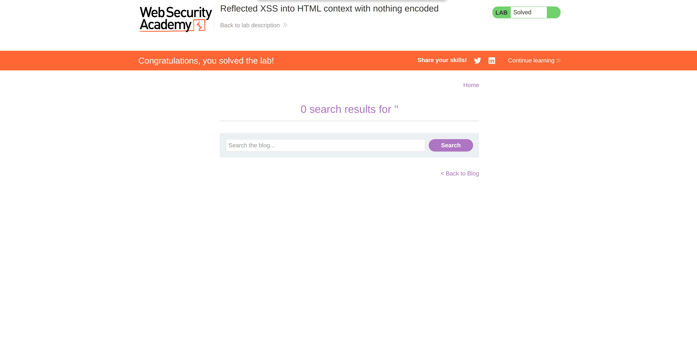

**Category:** XSS  
**Difficulty:** Apprentice  
**Status:** ✅ Solved  
**Lab Link:** [PortSwigger Lab](https://portswigger.net/web-security/cross-site-scripting/reflected/lab-html-context-nothing-encoded)

---

## 1. Objective
This lab contains a simple reflected cross-site scripting (XSS) vulnerability in the search functionality. The objective is to perform a cross-site scripting attack that successfully calls the `alert` function.

---

## 2. Background
### Reflected XSS
Reflected XSS occurs when an application takes data from an HTTP request (like a search query or URL parameter) and immediately reflects that data back into the response without sanitizing or encoding it. Because the malicious script is "reflected" off the server, the attack is usually delivered to the victim via a crafted link or form. When the victim clicks the link, the browser receives the response from the trusted server and executes the injected script.

### Attack Consequences
The consequences of XSS can range from minor annoyances to complete account compromise. If an attacker can execute JavaScript in a victim's browser, they can steal session cookies, hijack user sessions, redirect the user to malicious sites, or modify the content of the page. 

---

## 3. My Approach
1. I navigated to the target application and located the search bar.
2. I tested the search functionality by entering a basic HTML/JavaScript payload: `<script>alert(1)</script>`.
3. I submitted the search and observed the page response.
4. As shown in the screenshots, the application reflected my input directly onto the page, and the browser executed the JavaScript, popping up the alert box.




---

## 4. Payload Used
```html
<script>alert(1)</script>
```

---

## 5. Why It Worked
The payload worked because the application takes the user's input from the search parameter and reflects it directly into the HTML body of the response. Crucially, the application performs **no input validation and no output encoding**. 

Because the input is placed directly into the HTML context without being sanitized, the browser parses the `<script>` tag as a legitimate HTML element. It then executes the JavaScript code inside it (`alert(1)`) because it trusts the source (the web server).

---

## 6. How to Fix It
To prevent this vulnerability, developers must implement **context-aware output encoding**. 

Since the user input is being reflected directly into the HTML body, the application should encode special HTML characters into their HTML entity equivalents before rendering them on the page. For example:
- `<` becomes `&lt;`
- `>` becomes `&gt;`
- `&` becomes `&amp;`
- `"` becomes `&quot;`

By encoding these characters, the browser will treat the input as plain text rather than executable code. Additionally, implementing a strong Content Security Policy (CSP) can act as a secondary defense to prevent the execution of inline scripts.

*For more information, see: [OWASP XSS Prevention Cheat Sheet](https://cheatsheetseries.owasp.org/cheatsheets/Cross_Site_Scripting_Prevention_Cheat_Sheet.html)*

---

## 7. Key Takeaway
Always encode user input based on the context where it is placed in the DOM. In an HTML body context, applying HTML entity encoding ensures the browser treats user input as safe text rather than executable code.
