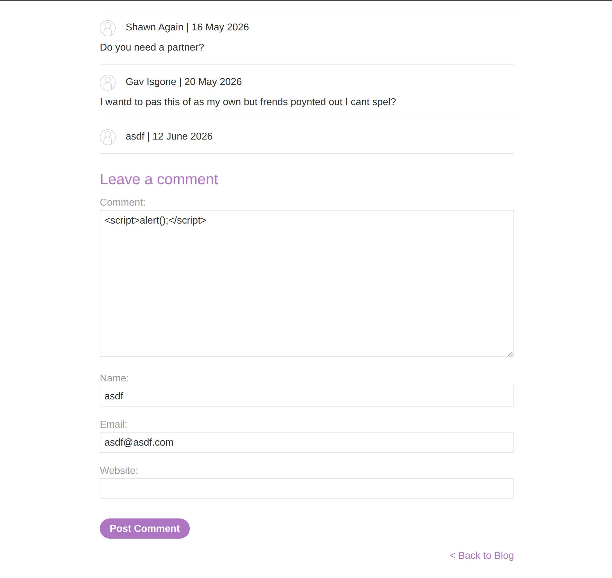
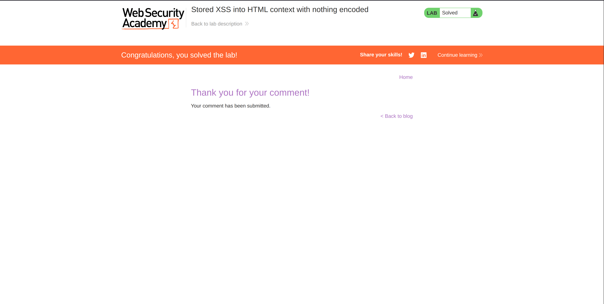
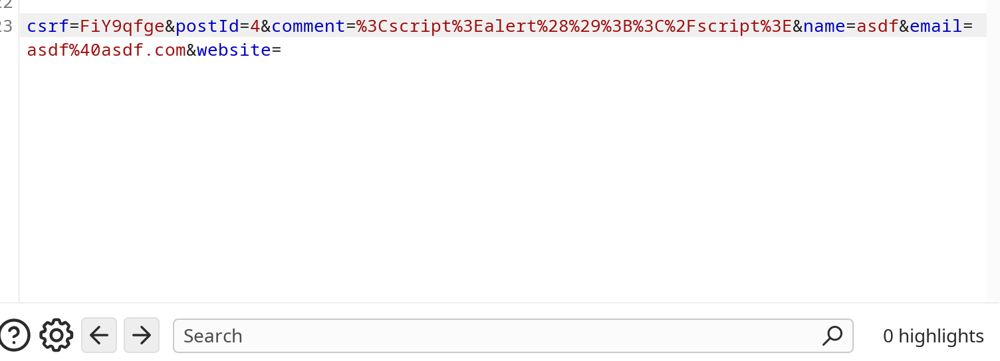

**Category:** XSS  
**Difficulty:** Apprentice  
**Status:** ✅ Solved  
**Lab Link:** [PortSwigger Lab](https://portswigger.net/web-security/cross-site-scripting/stored/lab-html-context-nothing-encoded)

---

## 1. Objective
This lab contains a stored cross-site scripting vulnerability in the comment functionality. To solve the lab, submit a comment that calls the `alert` function when the blog post is viewed.

---

## 2. Background
### Stored XSS Attacks
Stored XSS (also known as Persistent or Type-II XSS) occurs when the injected script is permanently stored on the target server, such as in a database, message forum, visitor log, or comment field. The malicious script is then retrieved and executed by the victim's browser when they request the stored information. Unlike reflected XSS, stored XSS does not require the victim to click a malicious link; simply visiting the affected page triggers the attack.

---

## 3. My Approach
1. I navigated to a blog post and scrolled down to the "Leave a comment" section.
2. In the comment field, I entered the payload: `<script>alert(1)</script>`.
3. I filled in the other required fields (Name, Email) with dummy data.
4. I clicked "Post Comment" to submit the form.
5. When the page reloaded, the comment was displayed, and the JavaScript was executed immediately, triggering the alert box.







---

## 4. Payload Used
```html
<script>alert(1)</script>
```

---

## 5. Why It Worked
The payload worked because the application stored the user's comment in the database without sanitizing the input. When the blog post page was loaded, the application retrieved the comment from the database and rendered it directly into the HTML response **without any output encoding**.

Since the malicious `<script>` tag was stored and served as part of the legitimate HTML page, the browser interpreted it as valid code from a trusted source and executed it. This is the defining characteristic of Stored XSS: the payload is saved permanently and affects any user who views the compromised content.

---

## 6. How to Fix It
To prevent stored XSS vulnerabilities, developers should implement multiple layers of defense:

1. **Input Validation:** Validate and sanitize all user input on the server side before storing it in the database. Reject any input that contains dangerous characters or HTML tags if they are not expected.

2. **Output Encoding:** Encode user-generated content when rendering it back to the page. Convert special characters to their HTML entity equivalents (e.g., `<` to `&lt;`, `>` to `&gt;`) so the browser treats them as text, not executable code.

3. **Content Security Policy (CSP):** Implement a strict CSP to restrict the sources from which scripts can be loaded. This can prevent inline scripts (like the one used in this lab) from executing even if they are injected.

4. **HTTPOnly Cookies:** Mark session cookies as `HttpOnly` to prevent JavaScript from accessing them, mitigating the risk of session hijacking even if XSS is successful.

*For more information, see: [OWASP XSS Prevention Cheat Sheet](https://cheatsheetseries.owasp.org/cheatsheets/Cross_Site_Scripting_Prevention_Cheat_Sheet.html)*

---

## 7. Key Takeaway
Stored XSS is particularly dangerous because the malicious payload is permanently saved on the server and automatically executes whenever a user visits the affected page. Always sanitize input before storing it and encode output before rendering it to the browser.
