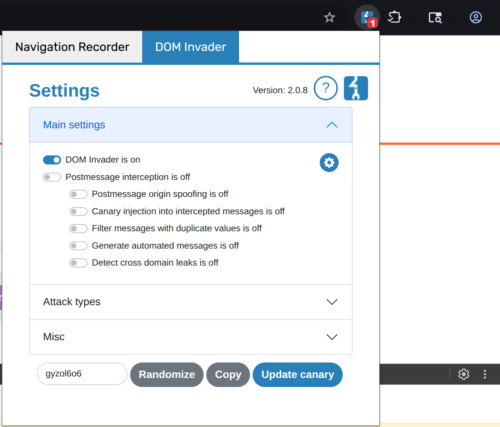
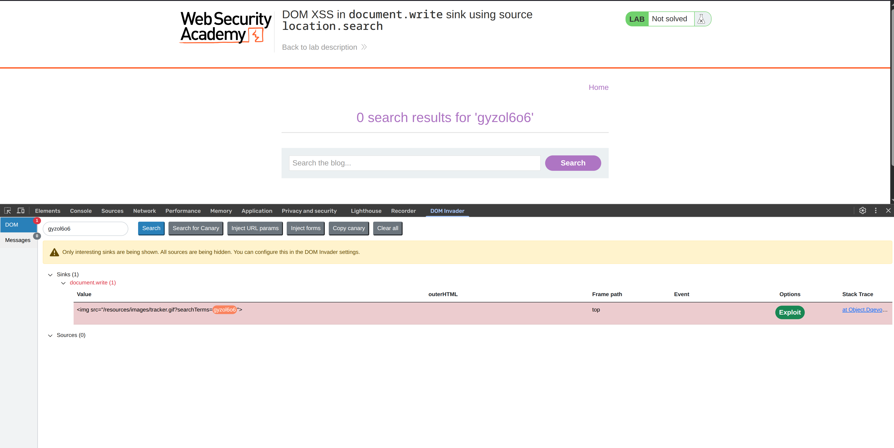
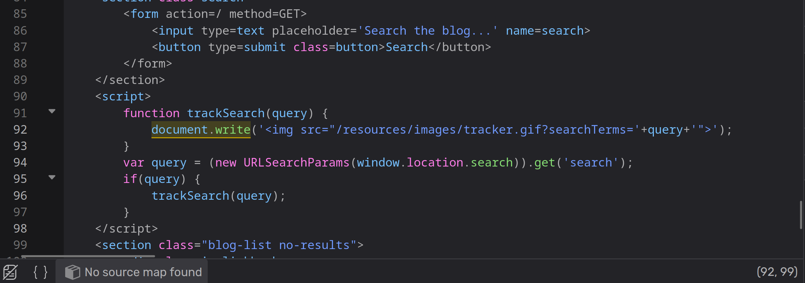
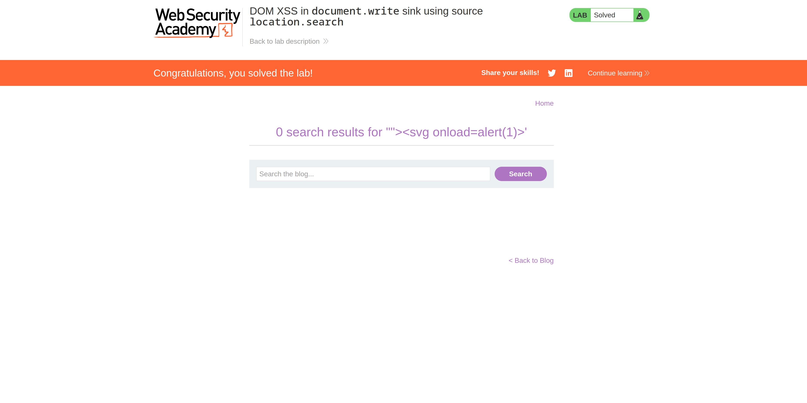

**Category:** XSS  
**Difficulty:** Apprentice  
**Status:** ✅ Solved  
**Lab Link:** [PortSwigger Lab](https://portswigger.net/web-security/cross-site-scripting/dom-based/lab-document-write-sink)

---

## 1. Objective
This lab contains a DOM-based cross-site scripting vulnerability in the search query tracking functionality. It uses the JavaScript `document.write` function, which writes data out to the page. The `document.write` function is called with data from `location.search`, which you can control using the website URL. To solve this lab, perform a cross-site scripting attack that calls the `alert` function.

---

## 2. Background
### DOM-Based XSS
DOM-based XSS (also known as "type-0 XSS") is an XSS attack wherein the attack payload is executed as a result of modifying the DOM environment in the victim's browser. The page itself (the HTTP response) does not change, but the client-side code contained in the page executes differently due to malicious modifications in the DOM.

### Dangerous Sinks
The following are common sinks that can lead to DOM-XSS vulnerabilities:
- `document.write()`
- `document.writeln()`
- `element.innerHTML`
- `element.outerHTML`
- `element.insertAdjacentHTML`
- `element.onevent`

jQuery functions that are also dangerous sinks include: `html()`, `append()`, `prepend()`, `after()`, `before()`, and many others.

For more information see:
- https://portswigger.net/web-security/dom-based
- https://owasp.org/www-community/attacks/DOM_Based_XSS

---

## 3. My Approach

### First Approach: Using Burp Suite DOM Invader
1. Opened Burp Suite and navigated to Proxy > Open Browser.
2. In the browser, pasted the lab URL in the address bar.
3. In the top right corner, clicked on the extensions icon and navigated to the DOM Invader tab.



4. Copied the canary token and pasted it in the search bar, then clicked Search.



5. Pressed F12 to open Developer Tools and found the DOM Invader tab.
6. Clicked the "Exploit" button, which redirected me to a URL similar to:
```
https://<LAB-ID>.web-security-academy.net/?search=%22%27%3E%3Cimg%20src%20onerror=alert(1)%3E
```

### Second Approach: Manual Code Analysis
1. Opened the browser debugger (F12) and searched for the `search` keyword or the vulnerable function:

```javascript
function trackSearch(query) {
    document.write('');
}
```



2. Analyzing the code, I noticed that the `query` parameter from `location.search` is directly concatenated into the `document.write()` function without any sanitization.

3. Crafted a payload to break out of the HTML attribute context:
```html
"'><svg onload=alert(1)>
```

4. Submitted the payload in the search bar:



### Third Approach: Using Dalfox Scanner
You can also use automated tools like `dalfox` to detect DOM XSS vulnerabilities:

```bash
dalfox scan https://<LAB-ID>.web-security-academy.net/?search=asdf
```

---

## 4. Payload Used

**DOM Invader payload (auto-generated):**
```
https://<LAB-ID>.web-security-academy.net/?search=%22%27%3E%3Cimg%20src%20onerror=alert(1)%3E
```
Decodes to: `"'>`

**Manual payload:**
```html
"'><svg onload=alert(1)>
```

**Automated scanning:**
```bash
dalfox scan https://<LAB-ID>.web-security-academy.net/?search=asdf
```

---

## 5. Why It Worked
The payload worked because the vulnerable JavaScript function `trackSearch()` takes user input from `location.search` (the URL query parameter) and directly passes it to `document.write()` without any validation or encoding.

When the search function is called, the code executes:
```javascript
document.write('');
```

By submitting the payload `"'><svg onload=alert(1)>`, I broke out of the `src` attribute context:
- The `"` closes the double-quoted `src` attribute value
- The `'` is borrowed from the DOM Invader universal payload format — it handles single-quoted attribute contexts too, so using both `"'` together breaks out regardless of which quote style the sink uses
- The `>` closes the `` tag
- The `<svg onload=alert(1)>` injects a new SVG element with an event handler that executes when the page loads

Since `document.write()` writes directly to the HTML document and the browser parses it as legitimate HTML, the malicious SVG element is created and the `onload` event fires, executing the JavaScript code.

---

## 6. How to Fix It
To prevent DOM-based XSS vulnerabilities, developers should:

1. **Avoid Dangerous Sinks:** Never use `document.write()` with user-controlled data. Use safer alternatives like `textContent` or `setAttribute()` which automatically encode data.

2. **Input Validation:** Validate and sanitize all data from sources like `location.search`, `location.hash`, `document.referrer`, and `window.name` before using them.

3. **Context-Aware Encoding:** If you must insert user data into the DOM, use proper encoding based on the context (HTML body, attribute, JavaScript, URL).

4. **Use Safe APIs:** Replace dangerous sinks with safe alternatives:
   - Instead of `element.innerHTML`, use `element.textContent`
   - Instead of `document.write()`, use `document.createElement()` and `appendChild()`

5. **Content Security Policy (CSP):** Implement a strict CSP to restrict script execution and prevent inline event handlers like `onload` or `onerror`.

*For more information, see: [OWASP DOM-based XSS Prevention Cheat Sheet](https://cheatsheetseries.owasp.org/cheatsheets/DOM_based_XSS_Prevention_Cheat_Sheet.html)*

---

## 7. Key Takeaway
DOM-based XSS occurs when JavaScript writes untrusted data from the URL or other client-side sources directly into the DOM using dangerous sinks like `document.write()`. Always validate and encode data on the client side, and avoid using dangerous DOM manipulation functions with user-controlled input.
