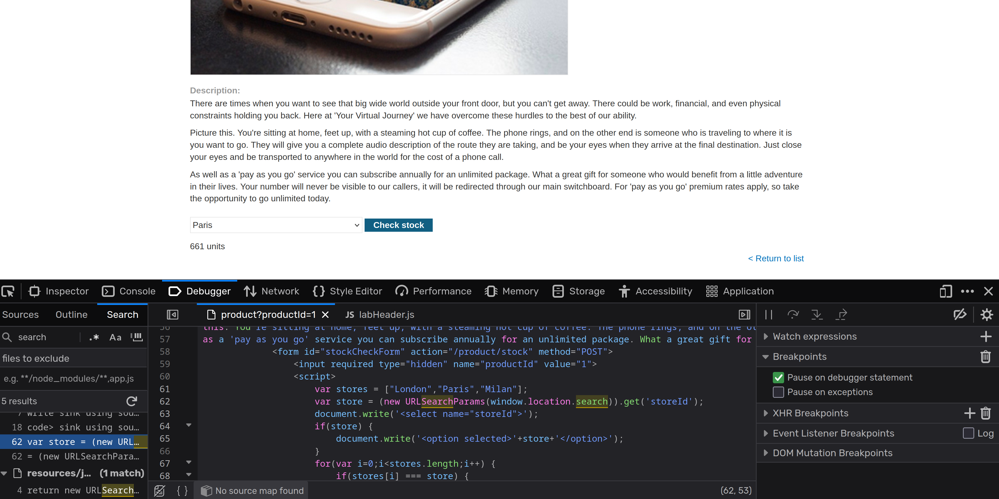
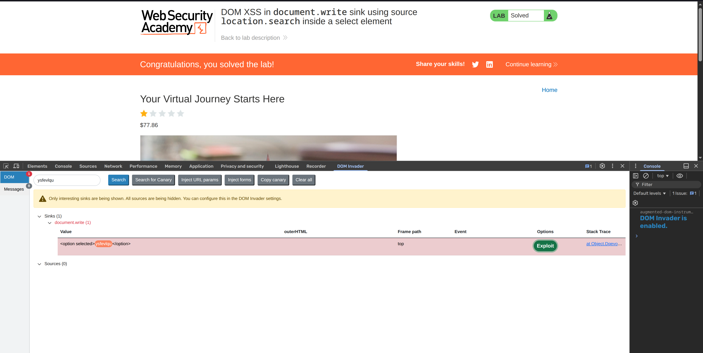

**Category:** XSS  
**Difficulty:** Practitioner  
**Status:** ✅ Solved  
**Lab Link:** [PortSwigger Lab](https://portswigger.net/web-security/cross-site-scripting/dom-based/lab-document-write-sink-inside-select-element)

---

## 1. Objective
This lab contains a DOM-based cross-site scripting vulnerability in the store selector functionality. The page uses `document.write()` to dynamically generate a `<select>` dropdown menu, and user input from the URL parameter `storeId` is inserted into the page without proper sanitization. To solve the lab, perform a cross-site scripting attack that calls the `alert` function.

---

## 2. Background
This lab is similar to [Lab 3](03.%20DOM%20XSS%20in%20document.write%20sink%20using%20source%20location.search.md) but with an additional challenge: the injection point is inside a `<select>` HTML element. 

When the injection point is within an HTML element like `<select>`, `<textarea>`, or `<option>`, you must first break out of the element's context before you can inject executable JavaScript. This requires understanding the HTML structure and crafting a payload that closes the existing tags properly.

---

## 3. My Approach

### First Approach: Manual Code Analysis
1. Opened the browser Developer Tools (F12) and searched for the keyword `search` or `storeId`.
2. Found the vulnerable JavaScript code:

```javascript
var stores = ["London","Paris","Milan"];
var store = (new URLSearchParams(window.location.search)).get('storeId');

document.write('<select name="storeId">');

if(store) {
    document.write('<option selected>'+store+'</option>'); // Injection point is here
}

for(var i=0;i<stores.length;i++) {
    if(stores[i] === store) {
        continue;
    }
    document.write('<option>'+stores[i]+'</option>');
}

document.write('</select>');
```



3. Analyzed the code and realized that the `store` variable is inserted directly into an `<option>` tag without sanitization.
4. Crafted a payload to break out of the `<option>` tag and inject a `<script>` element.
5. Injected the payload via the URL parameter `storeId`.

### Second Approach: Using DOM Invader
1. Copied the canary token from DOM Invader.
2. Modified the URL to include the canary:
```
https://<LAB-ID>.web-security-academy.net/product?productId=1&storeId=ysfevkqu
```
3. Pressed Enter to load the page with the canary.
4. In the DOM Invader tab, clicked "Search" to detect the vulnerability.



5. Clicked "Exploit" and was redirected to a URL similar to:
```
https://<LAB-ID>.web-security-academy.net/product?productId=1&storeId=%22%27%3E%3Cimg%20src%20onerror=alert(1)%3E
```

---

## 4. Payload Used

**URL-encoded payload:**
```
https://<LAB-ID>.web-security-academy.net/product?productId=1&storeId=%3C/option%3E%3Cscript%3Ealert(1)%3C/script%3E
```

**Decoded payload:**
```html
</option><script>alert(1)</script>
```

**Alternative payload (from DOM Invader):**
```html
"'>
```

---

## 5. Why It Worked
The payload worked because the vulnerable code directly concatenates user input from the `storeId` URL parameter into the `document.write()` function without any validation or encoding.

The critical line is:
```javascript
document.write('<option selected>'+store+'</option>');
```

When I submitted the payload `</option><script>alert(1)</script>`, the resulting HTML became:
```html
<select name="storeId">
    <option selected></option><script>alert(1)</script></option>
    <option>London</option>
    <option>Paris</option>
    <option>Milan</option>
</select>
```

The payload successfully:
1. **Closed the existing `<option>` tag** with `</option>`
2. **Injected a new `<script>` element** with `alert(1)`
3. **Broke the HTML structure**, but the browser's parser was forgiving enough to execute the script

Since `document.write()` writes directly to the document and the browser parses it as HTML, the `<script>` tag is recognized and executed immediately.

---

## 6. How to Fix It
To prevent this DOM-based XSS vulnerability, developers should:

1. **Avoid document.write() with User Input:** Never use `document.write()` to insert user-controlled data into the DOM. Use safer DOM manipulation methods instead.

2. **Use Safe DOM APIs:** Replace `document.write()` with safer alternatives:
```javascript
// Safe approach
var select = document.createElement('select');
select.name = 'storeId';

if(store) {
    var option = document.createElement('option');
    option.selected = true;
    option.textContent = store; // textContent automatically encodes
    select.appendChild(option);
}

stores.forEach(function(storeName) {
    if(storeName !== store) {
        var opt = document.createElement('option');
        opt.textContent = storeName;
        select.appendChild(opt);
    }
});
```

3. **HTML Entity Encoding:** If you must use `document.write()`, encode special HTML characters:
   - `<` becomes `&lt;`
   - `>` becomes `&gt;`
   - `&` becomes `&amp;`
   - `"` becomes `&quot;`

4. **Input Validation:** Validate the `storeId` parameter against a whitelist of allowed values (e.g., only accept "London", "Paris", "Milan").

5. **Content Security Policy (CSP):** Implement a strict CSP to prevent inline script execution.

*For more information, see: [OWASP DOM-based XSS Prevention Cheat Sheet](https://cheatsheetseries.owasp.org/cheatsheets/DOM_based_XSS_Prevention_Cheat_Sheet.html)*

---

## 7. Key Takeaway
When injecting payloads into HTML elements like `<select>`, `<textarea>`, or `<option>`, you must first break out of the element's context by closing the existing tags. Always use safe DOM manipulation methods like `createElement()` and `textContent` instead of `document.write()` to prevent DOM-based XSS vulnerabilities.

