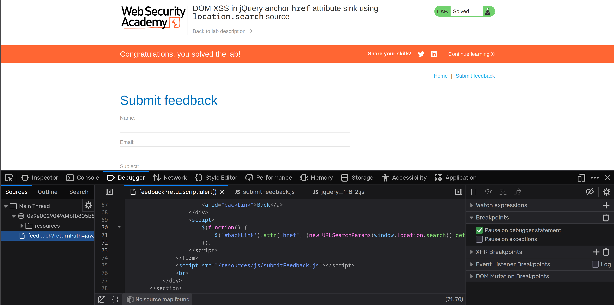

**Category:** XSS  
**Difficulty:** Apprentice  
**Status:** ✅ Solved  
**Lab Link:** [PortSwigger Lab](https://portswigger.net/web-security/cross-site-scripting/dom-based/lab-jquery-href-attribute-sink)

---

## 1. Objective
This lab contains a DOM-based cross-site scripting vulnerability in the submit feedback page. It uses the jQuery library's `$` selector function to find an anchor element, and changes its `href` attribute using data from `location.search`. To solve this lab, make the "back" link alert `document.cookie`.

---

## 2. Background
### jQuery Attribute Sinks
jQuery provides the `.attr()` method to get or set attributes of DOM elements. When user-controlled input is passed directly into the `.attr()` method to modify an `href` attribute, it can lead to DOM-based XSS. 

If an attacker can control the destination of a link, they can use the `javascript:` pseudo-protocol. When a user clicks a link with an `href` that starts with `javascript:`, the browser executes the code that follows it.

---

## 3. My Approach

### Manual Code Analysis
1. I navigated to the "Submit feedback" page.
2. I opened the Developer Tools (F12) and went to the Debugger/Sources section to inspect the JavaScript.
3. I found the following vulnerable jQuery code:

```javascript
$(function() {
    $('#backLink').attr("href", (new URLSearchParams(window.location.search)).get('returnPath')); // Injection point
});
```

4. I noticed that the `returnPath` parameter from the URL is directly passed into the `href` attribute of the "back" link (`#backLink`).
5. I crafted a payload using the `javascript:` protocol and injected it into the URL.



6. I clicked the "back" link on the page, which triggered the alert containing the session cookie.

---

## 4. Payload Used

**Decoded payload:**
```text
javascript:alert(document.cookie)
```

**Full URL:**
```text
https://<LAB-ID>.web-security-academy.net/feedback?returnPath=javascript:alert(document.cookie)
```

---

## 5. Why It Worked
The payload worked because the application uses jQuery's `.attr("href", ...)` to dynamically set the destination of the "back" link based on the `returnPath` URL parameter, without any validation.

Unlike previous DOM XSS sinks (like `innerHTML` or `document.write`) that execute immediately upon page load, this vulnerability requires user interaction. By injecting `javascript:alert(document.cookie)`, the `href` attribute of the anchor tag becomes a JavaScript URI. When the "back" link is clicked, the browser interprets the `javascript:` protocol and executes the payload instead of navigating to a new page. 

*(Note: The lab specifically required alerting `document.cookie` rather than just `alert(1)` to prove that the script has access to the victim's session data!)*

---

## 6. How to Fix It
To prevent this vulnerability, developers must validate the `returnPath` parameter before passing it to the `.attr()` method. 

1. **Whitelist Allowed Paths:** Ensure the parameter only contains relative paths (e.g., it must start with `/`).
2. **Block Dangerous Protocols:** Explicitly reject any input that starts with `javascript:`, `data:`, or `vbscript:`.
3. **Use Safe Navigation APIs:** Instead of modifying the DOM directly, consider using server-side redirects for returning to previous pages.

---

## 7. Key Takeaway
When user input controls the `href` attribute of a link, attackers can exploit the `javascript:` pseudo-protocol to execute arbitrary code when the link is clicked. Always validate that URLs are relative and block dangerous protocols.
