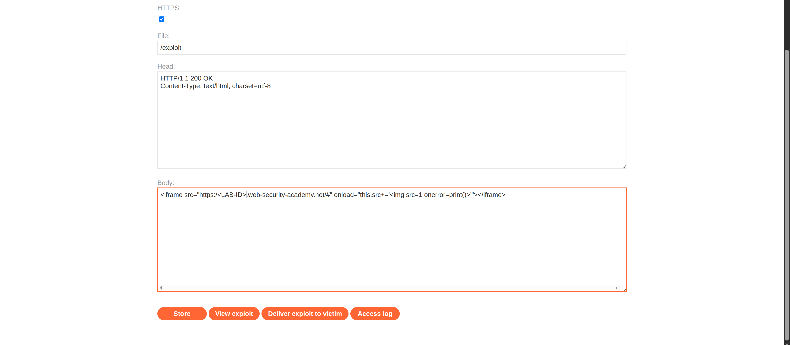

**Category:** XSS  
**Difficulty:** Apprentice  
**Status:** ✅ Solved  
**Lab Link:** [PortSwigger Lab](https://portswigger.net/web-security/cross-site-scripting/dom-based/lab-jquery-selector-hash-change-event)

---

## 1. Objective
This lab contains a DOM-based cross-site scripting vulnerability on the home page. It uses jQuery's `$()` selector function to auto-scroll to a given post, whose title is passed via the `location.hash` property. To solve the lab, deliver an exploit to the victim that calls the `print()` function in their browser.

---

## 2. Background
### jQuery Selector Sink with Hash Change
This vulnerability occurs when user input from `location.hash` (the fragment identifier in the URL) is passed directly to jQuery's `$()` selector function. The `hashchange` event fires whenever the fragment identifier changes, and if the application uses this value unsafely in a jQuery selector, it can lead to DOM-based XSS. jQuery's selector engine can interpret certain malformed inputs as HTML elements rather than CSS selectors, leading to code execution.

---

## 3. My Approach

### Testing the Vulnerability
1. First, I tested the vulnerability directly by navigating to:
```
https://<LAB-ID>.web-security-academy.net/#
```

2. This confirmed that the hash parameter was being processed unsafely by jQuery's selector.

### Creating the Exploit
3. To deliver the exploit to the victim (as required by the lab), I accessed the exploit server by clicking the link in the lab header.

4. In the body section of the exploit server, I crafted an iframe that loads the vulnerable page and injects the payload:

```html
<iframe src="https://<LAB-ID>.web-security-academy.net/#" onload="this.src+=''"></iframe>
```



5. I clicked "Deliver request to victim" to send the exploit.

---

## 4. Payload Used

**Direct test payload:**
```
https://<LAB-ID>.web-security-academy.net/#
```

**Exploit server iframe payload:**
```html
<iframe src="https://<LAB-ID>.web-security-academy.net/#" onload="this.src+=''"></iframe>
```

**URL-encoded version:**
```
%3Cimg%20src%3D1%20onerror%3Dprint%28%29%3E
```

---

## 5. Why It Worked
The vulnerability worked because the application listens for the `hashchange` event and passes the `location.hash` value directly to jQuery's `$()` selector function without sanitization.

When jQuery's `$()` function receives input that looks like HTML (starting with `<`), it attempts to create DOM elements from that string rather than treating it as a CSS selector. By injecting `#`, jQuery creates an `` element with an invalid `src` attribute.

The browser immediately attempts to load the image from the invalid source `1`, which fails and triggers the `onerror` event handler, executing `print()`.

The exploit delivery via iframe works because:
1. The iframe loads the vulnerable page with a base hash
2. The `onload` event fires when the iframe finishes loading
3. The payload is appended to the iframe's `src` attribute
4. This triggers a hash change, which fires the vulnerable event handler
5. The victim's browser executes the payload

---

## 6. How to Fix It
To prevent this DOM-based XSS vulnerability, developers should:

1. **Validate Hash Input:** Never pass `location.hash` directly to jQuery's `$()` selector. Validate and sanitize the input first.

2. **Use Safe Selector Methods:** If you need to select elements by ID from the hash, use safe DOM methods:
```javascript
// Vulnerable:
$(location.hash)

// Safe:
var hash = location.hash.substring(1); // Remove the #
var element = document.getElementById(hash);
```

3. **Escape Special Characters:** If you must use jQuery selectors, escape special CSS selector characters:
```javascript
var safeHash = $.escapeSelector(location.hash);
$(safeHash)
```

4. **Whitelist Allowed Values:** Only allow specific, expected hash values (e.g., valid post titles or IDs).

5. **Content Security Policy (CSP):** Implement a strict CSP to prevent inline event handlers like `onerror` from executing.

*For more information, see: [OWASP DOM-based XSS Prevention Cheat Sheet](https://cheatsheetseries.owasp.org/cheatsheets/DOM_based_XSS_Prevention_Cheat_Sheet.html)*

---

## 7. Key Takeaway
When `location.hash` is passed to jQuery's `$()` selector, it can be interpreted as HTML and create DOM elements, leading to XSS. Always validate hash input and use safe DOM methods like `getElementById()` instead of passing user input directly to jQuery selectors.
