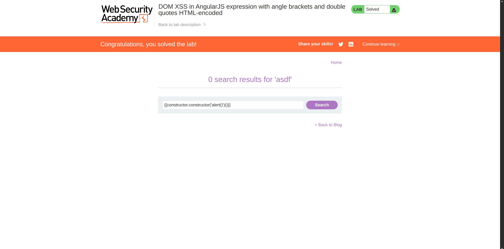

**Category:** XSS  
**Difficulty:** Practitioner  
**Status:** ✅ Solved  
**Lab Link:** [PortSwigger Lab](https://portswigger.net/web-security/cross-site-scripting/dom-based/lab-angularjs-expression)

---

## 1. Objective
This lab contains a DOM-based cross-site scripting vulnerability in an AngularJS expression within the search functionality. AngularJS is a popular JavaScript library that scans HTML nodes containing the `ng-app` attribute. When a directive is added, you can execute JavaScript expressions within double curly braces `{{ }}`. This technique is particularly useful when standard angle brackets (`< >`) are being encoded by the server. To solve this lab, perform a cross-site scripting attack that executes an AngularJS expression and calls the `alert` function.

---

## 2. Background
This vulnerability is a form of Client-Side Template Injection (CSTI). AngularJS uses double curly braces `{{ }}` to evaluate and render expressions. If user input is reflected inside these braces, AngularJS will execute it as code. Older versions of AngularJS included a "sandbox" to restrict access to dangerous global objects (like `window` or `alert`), which attackers must bypass using prototype chain traversal to execute arbitrary JavaScript.

---

## 3. My Approach

1. I navigated to the search bar and tested how the application handles input by injecting standard AngularJS expression syntax: `{{ }}`.
2. I realized that standard payloads like `{{alert(1)}}` were blocked by the AngularJS sandbox.
3. To bypass the sandbox, I used prototype chain traversal to access the global `Function` constructor.
4. I submitted the following payload in the search bar:
   `{{constructor.constructor('alert(1)')()}}`
5. Pressed Enter, and the alert successfully popped up.



---

## 4. Payload Used

**Decoded payload:**
```javascript
{{constructor.constructor('alert(1)')()}}
```

**URL-encoded payload:**
```text
https://<LAB-ID>.web-security-academy.net/?search=%7B%7Bconstructor.constructor%28%27alert%281%29%27%29%28%29%7D%7D
```

---

## 5. Why It Worked
The payload worked because the application reflects user input directly into an AngularJS expression context (`{{ }}`). While the AngularJS sandbox blocks direct access to global objects like `window` or `alert`, it does not block access to the `constructor` property of the current scope object.

Here is the step-by-step breakdown of the sandbox bypass:
1. `constructor`: Gets the constructor of the current scope object (which is `Object`).
2. `constructor.constructor`: Gets the constructor of `Object`, which is the global `Function` object.
3. `Function('alert(1)')`: The `Function` constructor takes a string of JavaScript code and creates a new function object from it.
4. `()`: The final set of parentheses executes the newly created function.

By traversing the prototype chain, we successfully reached the global `Function` constructor without explicitly referencing blocked global variables, allowing us to execute arbitrary JavaScript.

---

## 6. How to Fix It
To prevent Client-Side Template Injection and AngularJS sandbox bypasses, developers should:

1. **Never Reflect Input Inside Expressions:** Ensure that user input is never rendered inside AngularJS template expressions `{{ }}`. Use standard HTML text nodes instead.
2. **Upgrade AngularJS:** The AngularJS sandbox was completely removed in version 1.6 because it provided a false sense of security. Upgrading to the latest version of AngularJS (or migrating to modern Angular v2+) ensures that developers rely on proper Contextual Escaping rather than a flawed sandbox.
3. **Use Strict Contextual Escaping (SCE):** If you must render HTML, use Angular's `$sce` service to strictly sanitize and trust only safe content.
4. **Implement a Strong CSP:** A strict Content Security Policy that disables `unsafe-eval` will prevent the `Function` constructor from executing, effectively blocking this specific sandbox bypass.

---

## 7. Key Takeaway
When user input is reflected inside framework-specific template expressions (like AngularJS `{{ }}`), standard HTML encoding is not enough. Attackers can use prototype chain traversal to escape framework sandboxes and execute arbitrary JavaScript. Always avoid reflecting user input inside template evaluation contexts.
