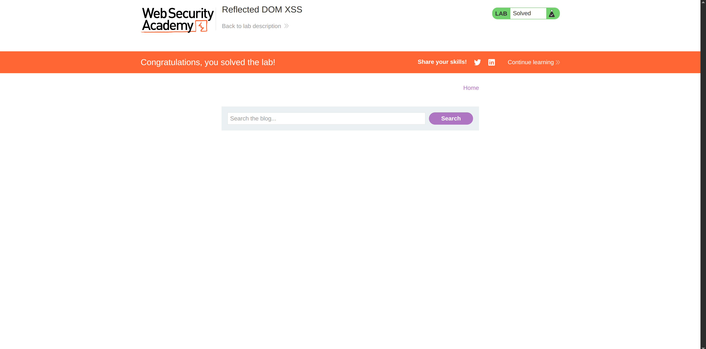

**Category:** XSS  
**Difficulty:** Practitioner  
**Status:** ✅ Solved  
**Lab Link:** [PortSwigger Lab](https://portswigger.net/web-security/cross-site-scripting/dom-based/lab-dom-xss-reflected)

---

## 1. Objective
This lab demonstrates a reflected DOM vulnerability. Reflected DOM vulnerabilities occur when the server-side application processes data from a request and echoes the data in the response. A script on the page then processes the reflected data in an unsafe way, ultimately writing it to a dangerous sink. To solve this lab, create an injection that calls the `alert()` function.

---

## 2. Background
A Reflected DOM XSS vulnerability happens when user input is reflected by the server in its raw form (e.g., inside a JSON response), and then a client-side script unsafely processes that data—often using dangerous functions like `eval()`. The attack is "reflected" because it comes from the current request, but it's "DOM-based" because the execution happens entirely on the client side after the page loads.

---

## 3. My Approach

1. I started by using the search bar and noticed that the web application makes an AJAX request to the server.
2. In the browser's Developer Tools, I observed that the server responds with a JSON object:
   ```json
   {"results":[],"searchTerm":"aaaa"}
   ```
3. I examined the JavaScript code handling the response and found this dangerous line:
   ```javascript
   eval('var searchResultsObj = ' + this.responseText); // Injection point
   ```
4. Since `eval()` directly executes the concatenated string as JavaScript, I needed to break out of the JSON string context for the `searchTerm` value.
5. I crafted a payload that would terminate the string, inject my JavaScript, and comment out the rest of the JSON to prevent syntax errors.
6. I searched for the following payload in the search bar:
   ```
   \"-alert(1)}//
   ```



7. The resulting JavaScript executed successfully, triggering the alert.

---

## 4. Payload Used

**Decoded payload:**
```
\"-alert(1)}//
```

**URL-encoded payload:**
```
https://<LAB-ID>.web-security-academy.net/?search=%5C%22-alert%281%29%7D%2F%2F
```

---

## 5. Why It Worked
The payload worked because the application uses `eval()` to parse a JSON response that contains user-controlled input. This is a catastrophic anti-pattern.

Here’s a step-by-step breakdown of what happened:

1. **Original JSON Structure:**
   ```json
   {"results":[],"searchTerm":"USER_INPUT"}
   ```

2. **After injecting `\"-alert(1)}//`:**
   The server reflected the input, creating this JSON:
   ```json
   {"results":[],"searchTerm":"\\"-alert(1)}//"}
   ```

3. **The `eval()` Execution:**
   The vulnerable JavaScript line becomes:
   ```javascript
   eval('var searchResultsObj = {"results":[],"searchTerm":"\\"-alert(1)}//"}');
   ```

4. **JavaScript Parsing:**
   - The first `"` starts the string value.
   - The `\\` is a JavaScript escape sequence for a literal backslash — both characters are consumed by the parser, leaving `\` as the string value so far.
   - The `"` immediately after `\\` is now **unescaped** (the backslash was already consumed). In JavaScript string literal parsing, an unescaped `"` **closes** the string. This is the core of the bypass — `\"` would keep the string open, but the raw `"` left exposed after `\\` eats the backslash does not.
   - We are now outside the string, and `-alert(1)}//` is raw JavaScript code.
   - The `-` acts as a subtraction operator between the string and `alert(1)`, keeping the expression syntactically valid.
   - `alert(1)` is executed as a function call.
   - The `}` closes the object literal.
   - The `//` comments out the trailing `"}`, preventing a syntax error.

By carefully crafting the payload to handle both JSON and JavaScript parsing rules, the injection successfully broke out of the data context and executed arbitrary code.

---

## 6. How to Fix It
To prevent this vulnerability, developers must **never use `eval()` to parse JSON**. Instead, they should use the safe, built-in `JSON.parse()` method:

```javascript
// VULNERABLE:
eval('var searchResultsObj = ' + this.responseText);

// SECURE:
var searchResultsObj = JSON.parse(this.responseText);
```

`JSON.parse()` only accepts valid JSON and will throw an error if the input is malformed or contains executable code. It treats the entire input as data, not as code, which completely neutralizes this attack vector.

Additionally, the server should validate and sanitize the `search` parameter before including it in the JSON response, though the primary fix is on the client side.

*For more information, see: [OWASP DOM-based XSS Prevention Cheat Sheet](https://cheatsheetseries.owasp.org/cheatsheets/DOM_based_XSS_Prevention_Cheat_Sheet.html)*

---

## 7. Key Takeaway
Using `eval()` to parse JSON is extremely dangerous because it allows attackers to inject and execute arbitrary JavaScript. Always use `JSON.parse()` instead, which safely converts JSON strings into objects without code execution.
