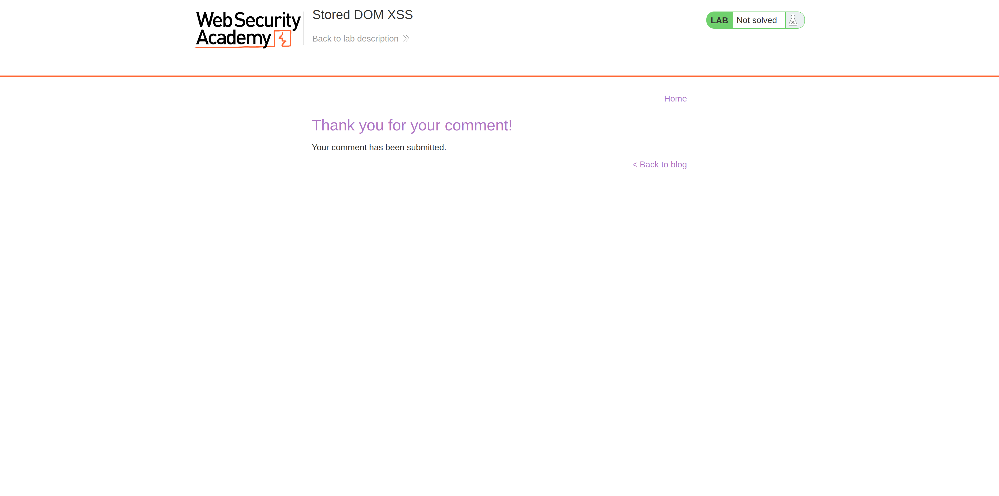
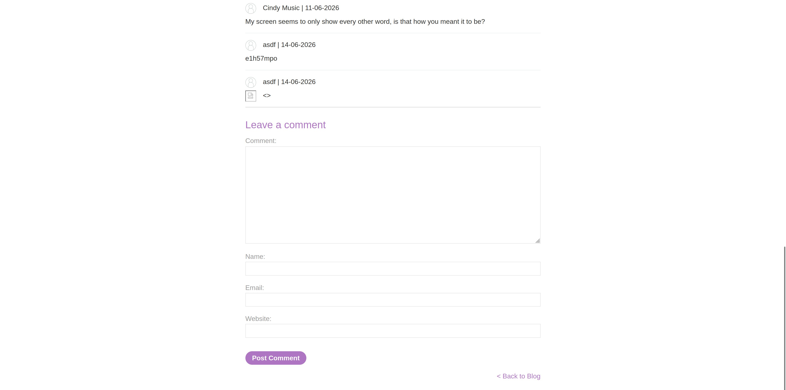

**Category:** XSS  
**Difficulty:** Practitioner  
**Status:** ✅ Solved  
**Lab Link:** [PortSwigger Lab](https://portswigger.net/web-security/cross-site-scripting/dom-based/lab-dom-xss-stored)

---

## 1. Objective
This lab demonstrates a stored DOM vulnerability in the blog comment functionality. To solve this lab, exploit this vulnerability to call the `alert()` function.

---

## 2. Background
Stored DOM XSS occurs when data is stored by the server (e.g., in a database) and later processed by client-side JavaScript in an unsafe way. Unlike traditional Stored XSS, where the server directly reflects the payload in the HTML response, in Stored DOM XSS, the server returns the data (often via an API or JSON), and the client-side script writes it to a dangerous sink like `innerHTML` without proper sanitization.

---

## 3. My Approach

1. I navigated to a blog post and opened the comment section.
2. I inspected the client-side JavaScript and found a custom sanitization function designed to strip HTML tags:

```javascript
function escapeHTML(html) {
    return html.replace('<', '&lt;').replace('>', '&gt;');
}
```

3. I noticed a critical flaw in this function: JavaScript's `replace()` method, when passed a string instead of a regular expression, **only replaces the first occurrence** of the target character.
4. To bypass this, I crafted a payload that includes a "decoy" `<` and `>` at the very beginning. These would be safely encoded, leaving the rest of my payload untouched.
5. I submitted the following payload in the comment box:
   `<>`
6. I clicked "Post Comment". When the page loaded and processed the stored comments, the alert successfully triggered.






---

## 4. Payload Used

```html
<>
```

---

## 5. Why It Worked
The payload worked because of a common misunderstanding of how JavaScript's `String.prototype.replace()` method works. 

When the `escapeHTML()` function processes the input `<>`:
1. `html.replace('<', '&lt;')` finds the **first** `<` and replaces it. The string becomes: `&lt;>`.
2. `.replace('>', '&gt;')` finds the **first** `>` (which is the one immediately following our decoy) and replaces it. The string becomes: `&lt;&gt;`.

Because the global regular expression flag (`/g`) was not used, the `<` and `>` characters inside the `` tag were completely ignored by the sanitization function. When the application later wrote this string to the DOM using a dangerous sink like `innerHTML`, the browser parsed the unescaped `` tag and executed the `onerror` event handler.

---

## 6. How to Fix It
To prevent this vulnerability, developers should implement multiple layers of defense:

1. **Server-Side Sanitization:** Never rely solely on client-side JavaScript for security. All input must be validated and sanitized on the server before it is stored in the database.
2. **Use Safe DOM Sinks:** Avoid using `innerHTML` to render user-generated content. Use `textContent` or `innerText` instead, which automatically treat the input as plain text and prevent HTML parsing.
3. **Use Proven Libraries:** If HTML rendering is strictly required, use a robust, battle-tested sanitization library like [DOMPurify](https://github.com/cure53/DOMPurify) rather than writing custom `replace()` functions.
4. **Fixing the Custom Function (Not Recommended):** If a custom function must be used, it should utilize regular expressions with the global flag: `html.replace(/</g, '&lt;').replace(/>/g, '&gt;')`. However, this is still highly discouraged compared to using standard libraries.

*For more information, see: [OWASP DOM-based XSS Prevention Cheat Sheet](https://cheatsheetseries.owasp.org/cheatsheets/DOM_based_XSS_Prevention_Cheat_Sheet.html)*

---

## 7. Key Takeaway
Client-side sanitization functions that use JavaScript's `replace()` without the global flag (`/g`) only replace the first occurrence of a character, making them easily bypassable. Always sanitize data on the server side and use safe DOM methods like `textContent` to prevent Stored DOM XSS.